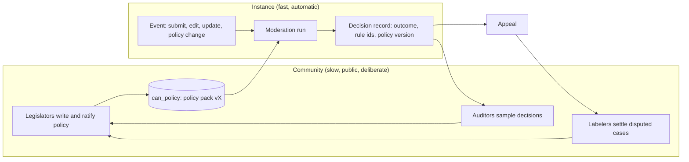

# AI design: community-legislated, AI-executed moderation

Status: design (W3, D-51 to D-53). No code exists yet. Slice 1 builds the whole pipeline with a deterministic `FakeModel`; the first live provider is founder-gated. Binding vocabulary comes from the founder model; this folder is the design that implements it.

## The idea in plain words

Most platforms ask a crowd, or a staff of moderators, to judge each post. That does not scale, it is slow, and it gives different answers to the same case.

CAN separates two things that are normally mixed together:

- **Consensus** is the community's shared, written agreement about what is allowed and why. It is slow, public and deliberate. It produces a **policy pack**: rules, one prompt per decision, labeled examples, thresholds and local overlays.
- **The instance** is one problem, one contribution, one edit. The community never judges instances. AI agents apply the ratified policy to every instance, explain the result with the rule and the policy version, and answer to appeal.

Policy is therefore **pre-decided** (ratified before content arrives) and **post-decided** (the community audits outcomes and amends the policy; affected content is then re-checked under the new version). The manifesto line becomes: people make every rule; AI applies it, explains it, and answers to appeal.

## Why this scales

- Cost grows with compute, not with headcount. A burst of 10x traffic needs more agent runs, not 10x volunteers.
- Every item gets the same standard at every event (before publication, on every update, after publication). Consistency is a property of the policy version, not of who was on shift.
- Humans spend their time on the part only humans can do: deciding what the rules should be, checking that the rules work, and labeling hard cases. Each labeled case improves the rules for everyone, so effort compounds instead of being spent once on one item.
- Cheap small models and caches handle the bulk; stronger models and the independent appeal re-run handle the hard tail.

## What humans do now

| Role | Does | Never does |
|---|---|---|
| Legislators | Write and ratify policy changes (PRs to `can_policy`) | Judge a single item |
| Auditors | Sampled quality review of past decisions; flag disagreement | Override one instance by hand |
| Labelers | Answer randomized, context-masked label tasks from appeals and eval needs | See who the appellant is |
| Emergency/legal lane | A small, logged lane for crisis and legal or law-enforcement matters (`escalate_human`) | Act as a general moderator |
| Maintainers | Run `can_policy` CI, rollouts and rollbacks | Merge without a ratification record |

Per-item moderators no longer exist. Humans do not override single instances by hand. The one exception is the emergency/legal lane, which is audited (see `appeals.md`).

## Guarantees that do not change

- Nothing becomes public without a passing run. If the run cannot finish, the outcome is `hold`, never publish (PUB-FAILCLOSED-1).
- Every decision is explainable: rule ids, field or span, revision hint, `policy_version`, appeal window (MOD-EXPLAIN-1).
- Nothing is removed silently. A flipped outcome shows "re-reviewed under policy vX" with an explanation and an appeal path.
- The privacy gateway sits before every model call (spec 14). Agents have no tools. User content is data, never instructions.
- Safety routing fails open (static crisis resources, CRISIS-STATIC-1); publication fails closed.
- Protected-core rules (constitution I.2) cannot be changed by a policy PR (OQ-rights-core-amendment).

## Map of this folder

| File | Contents |
|---|---|
| [policy-pack.md](policy-pack.md) | `can_policy` layout, pack format, layers, versioning, loading, example |
| [decision-points.md](decision-points.md) | Catalog of every `DP-*`: triggers, gates, outcomes, fail-closed behaviour |
| [runtime.md](runtime.md) | The moderation run: bus, selector, agent DAG, run record, cache, routing, budgets, providers |
| [triggers.md](triggers.md) | Pre-publication, on-update, post-publication; re-moderation semantics; ordering and backpressure |
| [amendment-loop.md](amendment-loop.md) | Proposal to ratification to staged rollout to rollback; anti-capture |
| [appeals.md](appeals.md) | Appeal-to-example loop and the emergency/legal lane |
| [safety-and-privacy.md](safety-and-privacy.md) | Gateway, zones, fail-closed matrix, bias, spend caps, abuse of the process |
| [evaluation.md](evaluation.md) | Eval sets, thresholds as gates, replay diff, slice-1 fixtures |

Decisions: [ADR 0008](../../adr/0008-ai-executed-community-policy.md) (supersedes 0006), [ADR 0009](../../adr/0009-can-policy-repo.md). Specs this builds on: `docs/spec/14-ai-privacy-gateway.md`, `docs/spec/15-ai-inference.md`, `docs/spec/06-moderation-geo-governance.md`, lifecycle table in `docs/spec/01-slice-1-brief.md#4-lifecycle`.

## Words used exactly

Policy pack, decision point (`DP-*`), moderation run, outcome (`publish`, `needs_revision`, `reject`, `route_external`, `hold`, `escalate_human`), replay diff, policy version, prompt hash, model id, shadow, canary.
