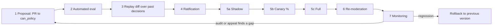

# Amendment loop: how the community changes the policy

The community legislates after the fact too. Moderation changes only through a PR to `can_policy`; nothing is tuned in production by hand.

## 1. Proposal

Anyone may open a PR: a new or changed rule, prompt, example, threshold or jurisdiction overlay. Sources: an auditor's finding, an appeal label (`appeals.md`), a law change, or a legislator's idea. The PR states the rule ids touched, the DPs affected, the reason, and which labeled examples motivate it. Protected-core changes (constitution I.2) are refused by CI and routed to the constitutional amendment process (VIII.2, OQ-rights-core-amendment).

## 2. Automated eval (gate)

CI runs the DP eval sets for every touched DP and for neighbours it could affect: recall on harmful classes, false-reject rate, calibration, schema validity, injection suite, privacy leakage, and per-jurisdiction parity (`evaluation.md`). Each metric has a threshold in `thresholds.yaml`. A miss blocks the PR; thresholds can only change through their own PR, ratified under the stricter of old and new rules.

## 3. Replay diff

The proposed pack re-runs over a stratified sample of past decisions (default: all appealed and near-threshold items plus a random sample per DP and jurisdiction, stored as redacted normalized inputs under the retention rules). The report, written to the PR, shows:

- flips by direction (stricter, more permissive) and by DP, rule and jurisdiction
- examples of flips as redacted spans, so reviewers judge the rule, not the person
- the share of flips that match the motivating examples versus unintended ones
- estimated cost and re-moderation volume

A diff above the approved flip limit for a minor version, or any unintended flip in a protected tier (privacy, crisis, rights), blocks until explained or fixed.

## 4. Ratification

Method is an open question (`docs/open-questions/OQ-policy-ratification-method.md`, proposed). **Default**, per the founder model:

- A **randomized, context-masked, cross-jurisdiction review panel** drawn from eligible participants (conflict declarations; no one from the proposer's cluster; seats include affected jurisdictions) reads the diff, eval report and replay report, never individual people's identities.
- **`can_policy` maintainers** confirm the CI evidence and the process was followed. They cannot ratify without the panel and cannot block a ratified change except for a failed gate.
- Quorum and thresholds are set before votes are collected; dissent is recorded and published with the ratification record in `ratifications/`.
- **Transitional founder stewardship** (constitution VIII.2, FOUNDER-TRANS-1): until a quorum exists, the founder approves v1 and subsequent versions, with a public log entry listing rule ids, `approved_by` and `expires_at`; the protected core stays out of reach. The sunset condition is `OQ-founder-stewardship-sunset`. A pack lacking `approved_by` or `expires_at` does not load.

**How the founder ratifies v1**: the founder reviews the slice-1 pack (rules from `rules.md`, one prompt per DP, fictional examples, FakeModel eval results), signs `ratifications/base-1.0.0.md` with scope, date, `expires_at` and the list of rule ids, and the log entry is published. Nothing about v1 is hidden: the pack is public and the record states it is founder-stewarded and interim until a panel exists.

### Ratification checklist (every PR)

A PR cannot be ratified until each item is recorded in `ratifications/`:

1. Rule ids, DPs, and schemas touched are listed; protected-core check passed.
2. Eval gates met on the touched and neighbouring DPs.
3. Replay diff reported, unintended flips explained, flip limit respected.
4. **Rollback plan:** the previous version and hash, the trigger metrics and thresholds for auto-rollback, who may trigger a manual rollback, how affected items are re-moderated, and the notice text for people affected. A PR with no rollback plan is not ratified.
5. **Adversarial-test gate:** the `adversarial` and `regression` sets pass, and the persona suite (`simulation.md`) was run deterministically on the PR; for any change to a harmful-class DP, privacy, naming, crisis, tone or injection defenses, a live persona attack run is required once the live gate exists, with 0 leaks and 0 injection successes.
6. For schema changes: form snapshots, in-flight draft migration plan, content replay count.
7. Dissent recorded; `approved_by` and `expires_at` present (FOUNDER-TRANS-1).

Failures found by persona runs enter this loop as labeled examples and draft PRs (`simulation.md` section 7).

## 5. Staged rollout

| Stage | What runs | Visible to people | Exit criteria |
|---|---|---|---|
| Shadow | New version runs beside the live one on real events; results stored with `shadow=true` | no | flips match replay predictions within a margin; no metric regression |
| Canary | New version decides for a small, randomized percentage of events (default 5%), per jurisdiction | yes, labeled by version | appeal and flip rates within bounds for a set number of events |
| Full | New version active; old stays loadable | yes | monitoring window passes |

The canary percentage is random, not by account class, so no group is systematically the test population. The server records the version used for every decision.

## 6. Re-moderation

After full rollout, post-publication runs (`triggers.md`) re-check affected content in throttled batches. Flipped items get the "re-reviewed under policy vX" notice, never silent removal.

## 7. Monitoring and rollback

- Watch overturn rate, flip rate, hold rate, cost per accepted result, parity across jurisdictions, and disagreement between auditors and the AI.
- **Rollback**: the previous version is one config change away (pinned hash, still loadable). A rollback is itself a recorded change, takes effect for new events at once, and triggers re-moderation of items decided under the bad version that the replay can identify. Auto-rollback triggers on a pre-set metric breach; humans can also trigger it with a short, public reason. A kill switch drops all DPs to `hold` plus the static crisis route (fails closed, not open).

## Anti-capture safeguards

- Randomized panels with cross-jurisdiction seats, conflict declarations, and rotation; reviewers never see who proposed or who is affected.
- **Disagreement tracking**: panel dissent, auditor-versus-AI disagreement and appeal overturns are published as aggregates; a rule with persistent disagreement is flagged for review.
- **Change history**: every change is a signed-off git commit with its eval and replay reports; the history is public.
- Proposal rate limits and a duplicate-proposal check; coordinated proposal or label bursts are flagged (poisoned labels, spec 06 section 9).
- Thresholds, parity bounds and the protected core cannot be loosened in the same PR that relies on the loosening.
- No community label becomes a prompt example or training data without provenance, privacy review, abuse checks and approval (spec 14 section 9, constitution V.5).
- The maintainers group is itself small, rotating and subject to the same disclosure; no maintainer can ratify alone.
