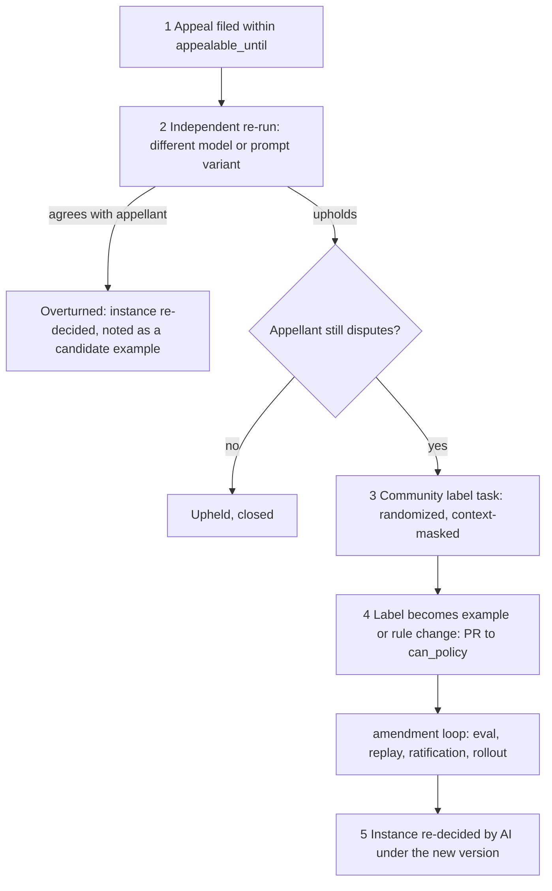

# Appeals and the human lane

Humans do not override single instances. An appeal changes the **policy** (through an example or rule PR) and the AI then re-decides the instance. The only manual path is the emergency/legal lane.

## Appeal-to-example loop

## Stage resolution appeals

A stage resolution by DP-STAGE-RESOLUTION is a moderation decision and is appealable (STAGE-RESOLVE-1), by the stage's poster or the contributor who submitted the evidence, within `appealable_until`. Grounds are typed: which criterion was misread, or which evidence was not considered (new evidence refs only, never new personal data). The independent re-run (DP-APPEAL) re-judges the stage against the same criteria. If overturned, the stage is re-decided through the normal pipeline: `resolved` if the evidence now meets the criteria, otherwise unchanged with the new explanation. While an appeal on a `resolving` or `blocked` stage is open, successor stages stay `planned`; an appeal on a stage that was already `resolved` and has live successors does not pause them (nothing is rolled back unless the overturn flips the result, which then follows the re-resolution notice path). A rejected plan-change proposal is appealable the same way. Volunteer recommendations are advice, not decisions, and are not appealable; a poster declining one needs only a reason (RECO-1). Publication refusals (DP-PUBLISH `reject`) use the ordinary loop below.

## Steps

1. **Appeal.** One appeal per decision (brief section 5), with grounds in plain words. Allowed until `appealable_until` (default 14 days). A rejected good-faith appeal has zero penalty (APPEAL-2).
2. **Independent re-run (DP-APPEAL).** Re-runs the appealed DP set with a **different model and a different prompt variant** than the original, with the appellant's grounds as quoted data. A "variant" is a registered alternate prompt in the pack (`prompt.alt.md`), so the check is not the same agent grading itself. If the re-run flips the result, the instance is overturned and re-decided by the normal pipeline with the new result recorded; the case is flagged as a candidate example. Effects on state follow the brief's appeal table (T02 back to `submitted`, T05 draft restored if still held, T19/T20 back, contribution restored).
3. **Community label task.** Only if the re-run upholds and the appellant disputes. A task has: the exact labeling question ("Does rule R apply to this text?"), only the minimum masked context (redacted text, no appellant or author identity, no handles), jurisdiction match where needed, conflict declaration, a fixed reviewer count and consensus rule set before labels arrive (constitution V.6, spec 14 section 9), and independence (labels collected before the aggregate is shown). Labelers are drawn at random from eligible participants.
4. **Label becomes example.** The aggregate label, with its disagreement record, is proposed as an example or rule change by an automated PR to `can_policy` (privacy-reviewed, redacted, provenance recorded). It then goes through the full amendment loop (eval, replay, ratification, staged rollout). The label never edits production directly (constitution V.5).
5. **Re-decision.** When the new version is active, the instance is re-decided by AI under it. The result and the policy version are shown to the appellant. If the new version was not ratified (rejected PR), the appeal closes as upheld with the panel's rationale.

Row-count check (APPEAL-1): an appeal outcome writes zero rows to grounding tables directly; only the PR path does.

## What the appellant sees

- The original decision with its rule ids, plain explanation, field or span, and `policy_version`.
- A status timeline: filed, independent re-run (result and that a different model was used), community label task (open, count only, no identities), policy change proposed (link to the public PR when privacy-safe), re-decision.
- The outcome explanation, the version used, and what to do next (resubmit, revise, or accept). If the re-run or panel said the rule is right but the wording unclear, the notice says so.
- Honest timing: the real queue age. The appeal is never closed silently by timeout; delays show as a status.
- Disclosure that no person overrode the decision by hand, and which model class family and prompt variant was used (not private prompt text for restricted rules).

## Emergency/legal lane

- **Scope**: only DP-CRISIS (credible imminent danger) and DP-LEGAL (legal process, law-enforcement requests, claims needing counsel), plus unresolvable PREC-1 conflicts at rights or crisis tier (`decision-points.md`).
- **Who**: a small, named, rotating group with training, conflict declarations, and least-privilege access to the minimum record (redacted case, run record, rule ids). It is staffed by the project or its legal partners, not by community moderators (`OQ-emergency-routing`, `OQ-legal-data-requests`, `OQ-legal-policy-reviewers`).
- **What it may do**: contact emergency or legal channels as the jurisdiction pack specifies, record a legal or safety hold on content, and answer a legal request. It may not publish content or overturn a rule decision on its own authority.
- **Audit**: every use writes an audit event (actor, time, case ref, rule ids, action, reason) and a lane log entry; no raw personal data in the log. A public aggregate report (counts by category and jurisdiction) is published periodically. A second lane member reviews each action after the fact; dispute goes to the independent oversight group (`OQ-lane-oversight`, proposed).
- **Feedback**: every lane case produces a redacted example candidate for the policy so the lane shrinks over time, not grows.
- Lane unavailable: the static crisis resources are already shown (CRISIS-STATIC-1) and the item stays held. Nothing is published to avoid waiting.
