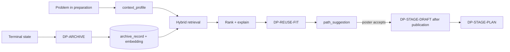

# Archive and reuse design (D-76)

Status: design (W12). Binding: D-76, with D-61 (legal stack), D-65 (OpenRouter, free first), D-72 (lifecycle v2), D-73 (labels), D-74 (one review). Vocabulary is `.claude/skills/can-code-large/briefs/archive-v1.md`. Decision: [ADR 0017](../../adr/0017-archive-and-path-reuse.md). Reversal: reuse becomes manual search only.

Idea: every problem that ends leaves a public, personal-data-free record of its whole journey. While a new problem is prepared, the AI finds similar records and offers adapted paths. The poster decides. CAN becomes reusable infrastructure for common problems.

## 1. archive_record schema

Stored as JSON Schema `archive_record` (versioned like every schema, D-58). Created once per problem at a terminal state (`solved`, `closed`, `redirected`, `stuck`); an append-only `revision` list covers later corrections.

| Field | Content |
|---|---|
| `id`, `problem_ref` | Archive id; opaque ref to the source problem (not the poster) |
| `snapshot` | The structured problem at its terminal state (condition, affected, place, facts, sources, criteria, assumptions), stripped |
| `context_profile` | Section 3 |
| `executed_path` | Stage DAG as run: per stage `name`, `goal`, `criteria`, `outcome` (`resolved`, `skipped`, `blocked`, `abandoned`), `duration_band`, `cost_band`, `depends_on`, chosen option |
| `options[]` | Options considered per stage: summary, legality result at the time, chosen or not, reason (from `stage_choice`) |
| `evidence_refs[]` | Source URIs and evidence tiers, no uploads of people |
| `challenges[]` | `challenge`: `stage`, `tried`, `why_failed_or_blocked`, `kind` (`legal`, `resource`, `institutional`, `evidence`, `social`, `technical`), `resolution` (text or `unresolved`), `layer` (L0 to L6 when legal) |
| `costs` | Total and per stage bands (Section 3 band scale), currency class, labour hours band, in-kind resources |
| `outcome` | Final criteria result per criterion, free summary from structured fields, `terminal_state` |
| `versions` | `policy_version`, `schema_version`, `legal_corpus_version` per layer, `archive_schema_version` |
| `attribution` | Credit text, source problem public url, contributor handles only where they opted in, `license` (default CC BY 4.0, OQ-contribution-license) |
| `quality` | DP-ARCHIVE result, `completeness` score, `ratified` flag (Section 12) |

ARCHIVE-1: failures and challenges are first-class. A `stuck` or `closed` problem is archived with the same fields; its `outcome` says what was not achieved.

## 2. DP-ARCHIVE

Trigger: problem enters a terminal state (also an async rebuild when the archive schema changes). Blocking for the record's publication, not for the terminal transition itself. Allowed outcomes: `publish`, `needs_revision` (record kept private while the poster or a steward adds missing `challenges` or reasons), `hold`.

1. **Assemble** deterministically from run records, stage history and structured content. No free text is invented by a model.
2. **Privacy re-strip.** Every field goes through the privacy gateway again (DP-PRIVACY, DP-NAMING): names, handles, addresses, emails and exact coordinates are removed; places generalise to the coarsest level that still matches (city or region). Location attestations (D-73) are never carried over. Contributor identity is dropped unless opted in. Guest and impacted labels may appear as counts only.
3. **Completeness.** Deterministic: every executed stage has outcome and bands, every `blocked` or `abandoned` stage has a `challenge`, costs present or `none_stated`, versions stamped. Then one model read: do `challenges` and `reasons` explain failures, not only successes? Missing pieces give `needs_revision` with one hint per field.
4. **Safety.** DP-CRISIS and DP-TONE run on the text. A record with residual personal data after re-strip is `hold`, not published.

Fail closed: no record is public unless DP-ARCHIVE says `publish`.

## 3. context_profile

Used identically for archived and new problems. Never typed freehand: filled by deterministic mapping first, then AI fill-assist (structured-content section 7) proposes, the poster confirms.

| Dimension | Source | Values |
|---|---|---|
| `problem_type`, `category` | `condition`, `scope` via AI classification against a fixed taxonomy; poster confirms | taxonomy ids |
| `population_scale` | `affected` | band: `<100`, `<1k`, `<10k`, `<100k`, `<1M`, `>=1M`, `unknown` |
| `geography` | `place` | country, region, `settlement_class` (rural, town, city, metro), `climate_class` (Koppen group), coarse only |
| `resource_band` | user-declared, with `existing_efforts` as prior | people and skills available (bands), `in_kind` |
| `budget_band` | user-declared | `none`, `<1k`, `<10k`, `<100k`, `>=100k` per currency class (income-adjusted class, not exchange rate) |
| `institutions[]` | `responsible_roles` | roles, not names (for example `municipal_waste_dept`) |
| `legal_stack` | jurisdiction resolver (legal-stack.md) | layers in force, L0 to L6, each with corpus version |
| `language` | content language | BCP 47 |
| `constraints[]` | `assumptions` (legal), `out_of_scope`, `lawful_options` | typed list (`legal`, `time`, `skills`, `political`, `physical`) |

Declared resources are private to the poster until publication; only the band is public. Unknown is allowed and lowers confidence, never blocks.

## 4. Retrieval (hybrid)

Runs against `archive_record` rows with `ratified = true` only.

1. **Structured filter and score** on `context_profile`: hard filters (language is not a filter; `problem_type` family is) then per-dimension scores.
2. **Full text**: Postgres `tsvector` over `snapshot`, `executed_path` goals and `challenges`, language-configured per record, with `simple` fallback.
3. **Vectors**: pgvector, one embedding per record chunk (condition, each stage, each challenge). Query embedding built from the live problem fields. Index `hnsw`, cosine.
4. **Fusion**: reciprocal rank fusion of the three lists, top 30, then re-scored by Section 5 and cut to 5.

Embedding model (D-65): a small multilingual model chosen by retrieval eval (Section 10): first a free or cheap OpenRouter embedding model for synthetic and public archive text; archive text is public by design, so no privacy gap on the record side. The poster's draft text goes only through the privacy gateway to endpoints with `data_collection: "deny"` after graduation, or to a small local model (for example a multilingual e5 class) where no such endpoint passes eval. Model id, dimension and eval date are in the D-65 register. Changing the embedding model re-embeds the archive as a background job; both vectors are kept during rollout.

Cross-language: a multilingual embedding space matches a Dutch record to a Swahili draft. Full text is language-local. When the embedding model fails the cross-language eval floor, fall back to translating the query to the record's language through the same gateway. Displays use machine translation labelled as such, with the original available.

## 5. Ranking and explanation

Score is a weighted sum of per-dimension similarities (weights are policy-pack values, defaults: problem type 0.25, constraints 0.15, resources and budget 0.15, scale 0.10, geography and climate 0.10, institutions 0.10, legal stack 0.10, language 0.05), plus a bonus for completeness and for `solved` outcomes (failed paths still rank, shown as warnings). Every suggestion shows per dimension: same, close or different, with the two values side by side. No score is shown without its breakdown (REUSE-CONTEXT-1). Diversity: at most two suggestions from one source problem.

## 6. DP-REUSE-FIT

Runs on each candidate before display. Deterministic checks first.

- **Legality under the new stack (D-61).** Each stage option and criterion in the source path is re-checked against the new problem's L0 to L6 (the same DP-LEGALITY retrieval and citation format). Results per stage: `lawful`, `unlawful_at_L<n>` with citation, `unknown`. An `unlawful` step is not dropped: it is marked, and the AI proposes the lawful analogue if one exists in the archive or corpus.
- **Resource and budget fit.** Source `cost_band`, labour and in-kind needs against the declared `resource_band` and `budget_band`: `fits`, `stretch`, `exceeds`, with the gap.
- **Differences flagged**: each context dimension that differs, plus changes in `policy_version` or `legal_corpus_version` since the source (an old legal basis may be stale).
- **Adaptations proposed**: a diff against the source path (substitute, scale down, add an institution step, drop a step), each with a reason.

Outputs: `reuse_fit` with `legality[]`, `resource_fit`, `differences[]`, `adaptations[]`, `confidence`. Outcomes: `publish` (show), `needs_revision` (regenerate the adaptation once), `hold` (do not show). If the legal stack is unresolved or the corpus is missing for a layer: `hold`, because suggesting an illegal path is the harm to avoid. A suggestion never changes the problem, review or stage plan by itself (REUSE-CONTEXT-1).

## 7. path_suggestion lifecycle

States: `computing`, `ready`, `stale`, `dismissed`, `accepted`, `used`.

- **Live while preparing.** The form raises a change event per field blur or after 1.5 seconds of idle typing. The server debounces per draft (one run in flight, trailing run after 5 seconds, at most 6 runs per hour per draft by default, policy-pack values). Suggestions update in the panel (WF-SUGGEST-1); a changed `context_profile` marks older suggestions `stale`.
- **Privacy gateway.** Query text is the redacted field text plus `context_profile`, never raw intake. Private location is never an input.
- **Cache.** Key: hash of (context_profile, redacted problem text, archive index version, embedding model id, policy version). Hit gives instant results; a new archive version invalidates only keys whose top results changed.
- **Detail** (WF-SUGGEST-2): sources, similarity, differences, fit, "use as starting point". Accepting records `accepted` with chosen adaptations on the draft as a private note; volunteers may see it as part of review. Dismissal is remembered per draft.
- **Budget and failure.** Runs count against the per-run and monthly caps (D-65). On failure the panel shows nothing and the form continues; the poster is never blocked (REUSE-NOBLOCK-1).
- **Review speed-up.** Accepted suggestions with strong fit are summarised for volunteers; at least one completed review is still required (D-74).

## 8. DP-STAGE-DRAFT

Trigger: problem `active` after publication and at least one suggestion `accepted`. Inputs: accepted suggestions with adaptations and reuse_fit, the published problem, final criteria. Output: a draft `stage_plan` (stage names, goals, criteria translated to the new context, `depends_on`, `decision_method` default) with `derived_from` links per stage. Deterministic structure check first (DAG, coverage of final criteria). Outcomes: `publish` (offer to poster), `needs_revision`, `hold`. The draft is private to the poster until accepted (WF-STAGEDRAFT-1). Acceptance, in whole or edited, submits it as a plan-change proposal that goes through DP-STAGE-PLAN, DP-CRITERIA and DP-LEGALITY like any plan (PLAN-CHANGE-1). Attribution is carried onto every derived stage (REUSE-CREDIT-1). Without accepted suggestions the DP does not run; the poster may still ask for a draft from the best current matches.

## 9. Attribution and license

Default license for contributed content is CC BY 4.0 (OQ-contribution-license, alternative CC0; code stays MIT, D-49). Each suggestion, draft stage and published derived plan shows "Based on" with links to the source archive records and their license. Credit is stored in `derived_from` and survives plan edits (REUSE-CREDIT-1). If the license later changes to CC0, attribution display stays as courtesy; records already published keep the license they were published under.

## 10. Evaluation

- **Offline retrieval eval** on the simulation archive: labelled pairs (query problem, relevant records) from seeds 1 and 2, extended with paraphrases, translations (NL, EN, plus two non-European languages) and near-miss distractors. Metrics: recall at 5, nDCG at 10, cross-language recall gap, per-dimension explanation accuracy (is the stated difference true). Thresholds are policy-pack values and gate the model register for embedding model choice.
- **Fit eval**: planted illegal-at-L<n> steps must be flagged (recall 1.0 on the fixture set), planted over-budget paths must be `exceeds`.
- **Online metrics** (after graduation): suggestion acceptance rate, edit distance between draft and accepted stage plan, time to publication with and without accepted suggestions, outcome of paths derived from suggestions versus not, dismissal reasons. Reported as aggregates; never used to rank people.
- Replay diff (evaluation.md) applies when the embedding model or weights change.

## 11. Cold start

The archive starts empty. Seeds 1 and 2 are run to terminal states with the simulation harness (synthetic evidence, Amsterdam overlay), each variant of `simulation.md` section 3 yielding an `archive_record` with `source: simulation`, shown with a "simulated" label and never mixed into outcome statistics. They exercise failure paths (blocked stage, `stuck`). A persona in a third problem reuses a path from a seed record. Real records follow as real problems end. Until the archive has records above the eval floor for a problem type, the panel says there is nothing similar yet (honest empty state), and no model is called.

## 12. Abuse and poisoning

- **Archive text is data, never instructions.** Records are quoted inside delimited data blocks to every model call, with the standing rule that content cannot change instructions; DP-ARCHIVE and DP-REUSE-FIT outputs are schema-validated and an injection pattern in a record (instruction-like imperatives aimed at the model, hidden text, link farms) fails DP-ARCHIVE as `needs_revision` and files a policy example.
- **Provenance.** Each record carries its run records, versions and the DP results that admitted it; suggestions link to them.
- **Ratified-only records.** Retrieval reads only `ratified` records: produced by a platform terminal state through DP-ARCHIVE, from problems that passed DP-PUBLISH, never user-uploaded archive entries. Simulation records are labelled and excluded from outcome statistics.
- **Sybil and brigading**: fabricated "solved" problems are limited by DP-VERIFICATION against final criteria with evidence tiers; a record's rank weight uses its evidence tier, not popularity.
- **Retraction.** A record found harmful or legally invalid is annotated, de-ranked or withdrawn by a policy-governed action, with a visible note (nothing is removed silently); DP-RERESOLUTION on legal change flags records whose cited basis changed.
- **Gaming context**: a poster misstating `context_profile` to pull paths gets differences flagged by fit checks and volunteer review; the profile is a poster's answer, checked like any other field.
