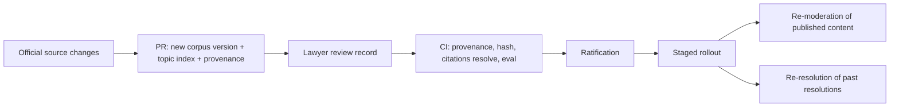

# Legal stack: lawful everywhere (D-61)

CAN must never request or publish anything illegal in any jurisdiction it operates in. Legality is therefore not one check against one law pack. It is a **cumulative stack**: every moderation run, and every DP that judges legality, applies all layers that exist for the item's jurisdiction. Content and solutions must satisfy every layer. This keeps CAN defensible against blocking and gives the AI a concrete, checkable starting point.

Proposed rule ids (the spec owner adds them): `LEGAL-STACK-1` (all layers apply cumulatively), `LEGAL-CITE-1` (every legality decision cites layer, article and corpus version), `LEGAL-TOPIC-1` (topic forbidden locally is not published there and the refusal is logged with its basis), `LEGAL-CORPUS-1` (a corpus change is lawyer-reviewed and ratified), `LEGAL-SRC-1` (legal-source integrity, constitution IV.6).

## 1. The layers

| Layer | Content | Applies | Source examples |
|---|---|---|---|
| L0 | CAN platform rules | always | `packs/base`, `packs/constitution` |
| L1 | UN human rights | always, as a floor | UDHR, ICCPR, ICESCR |
| L2 | Supranational, where binding (default per jurisdiction) | NL: EU Charter of Fundamental Rights, EU law, ECHR | EUR-Lex, HUDOC |
| L3 | National constitution | national jurisdiction | official gazette or government publisher |
| L4 | National law | national jurisdiction | national statute database |
| L5 | Regional law | where the region has competence | provincial publication |
| L6 | City rules | city jurisdiction | municipal bylaws register |

Evaluation is **cumulative, not first-match**. An item is lawful only if no layer blocks it. Conflicts between layers do not pick a winner by guess: where a higher layer (for example L2 over L4) blocks, it blocks. Where layers disagree on interpretation, the DP returns `hold` with a conflict note, never publish (fail closed). Precedence for rights remains PREC-1 (constitution I.2): rights outrank procedure. A lower layer may restrict further; it may not remove a floor set above it.

L1 is a floor and a source of rights arguments, not a replacement for binding law. A layer is marked `binding` or `reference` per jurisdiction in `pack.yaml`, because which international and supranational instruments bind a place depends on that place. Nothing in the stack is legal advice (spec 06); outputs say "applicable rule" with citations, and DP-LEGAL routes real legal process to the logged lane.

## 2. Corpora in `can_policy`

```
can_policy/packs/legal/
  L1-un/global/            udhr/ iccpr/ icescr/
  L2-supranational/nl/     eu-charter/ eu-law-index/ echr/
  L3-constitution/nl/      grondwet/
  L4-national/nl/          statutes/<code>/
  L5-regional/nl/<id>/
  L6-city/nl-amsterdam/    bylaws/
  each corpus: corpus.yaml  articles/  topic-index.json  review/
```

`corpus.yaml` per corpus carries the provenance (LEGAL-SRC-1):

| Field | Meaning |
|---|---|
| `source_url` | Canonical official URL |
| `official_publisher` | Body that publishes the authoritative text |
| `retrieval_date` | When the text was fetched |
| `version` and `effective_from`, `effective_to` | Version of the instrument and when it applies |
| `content_hash` | SHA-256 of the stored article text (included in `pack_hash`) |
| `license` | Reuse licence of the text |
| `language` | Authoritative and any translation (translations are labeled, never the authority) |
| `reviewer` | Lawyer or legal team record, date, scope reviewed |

Integrity rules: corpora are stored from the official publisher only; a translation or summary is never the cited text; an article without provenance is not loadable; a changed hash with no review record fails the loader. Text is stored as articles with stable ids (`L2/nl/echr/art-10`), so a citation resolves to exact text at an exact version, years later, for replays and appeals. Corpora pin into the pack hash, so `policy_version` covers the law that was applied.

## 3. Retrieval, never whole codes

A prompt never contains a whole code or treaty (context budgets, spec 15). Each corpus has a **topic index**: article id to topics, actors, actions and typical constraint kinds, built and reviewed with the corpus. The runtime:

1. Reads the item's typed fields (topic, `place`, `responsible_roles`, proposal `mechanism` and `authority`). The structured schema (`structured-content.md`) is what makes this reliable.
2. Selects layers for the jurisdiction and date.
3. Looks up candidate articles per layer from the topic index (deterministic first, optional embedding ranking within the index), takes the top few per layer under a per-run token budget, and always includes any article flagged `always` for the DP.
4. Puts those articles, with ids and versions, in the rules slice of the prompt, outside the data block.
5. Records the article ids and corpus versions in the run record (cache key includes them).

If retrieval finds no article for a layer, the output says "no applicable article found in L4 (version)", which is a recorded fact, not a pass. Low retrieval confidence on a risky topic escalates to a stronger model, then `hold`.

## 4. How DPs use the stack

- **DP-LEGALITY** (proposals, decision records, solution contributions): for each layer, either cites the article that constrains or permits the mechanism, or states none was found. A block yields the `stuck` payload (blocking constraint, source and version, blocked actions, recheck condition) with the layer and article. Every decision cites `{layer, article_id, corpus_version}` (LEGAL-CITE-1); a decision without a citation fails schema validation.
- **DP-ELIGIBILITY, DP-TONE, DP-NAMING, DP-PRIVACY** also read the relevant L1 to L6 articles when the rule is law-backed (for example hate-speech limits, data protection). They cite them in the same format.
- **DP-LEGAL** detects legal process and legal-risk claims; it cites the instrument that makes the text a legal matter and routes to the lane.
- **DP-ASSUMPTIONS** (legal kind) checks stated legal premises against retrieved articles.

### Two different legal outcomes

| Situation | Handling |
|---|---|
| **The topic is forbidden by local law** (publishing the problem itself is unlawful in that jurisdiction) | The problem is **not published** in that jurisdiction. The refusal is **logged with its legal basis** (layer, article, version) and the poster gets a plain explanation with the citation and an appeal path (`reject`, appealable, or `route_external`). Where the topic is lawful elsewhere, a different jurisdiction overlay may allow it; the decision is per jurisdiction, never global. |
| **Only the solution is illegal** | The problem is lawful to publish. The proposal is blocked, the problem moves to `stuck` (legally blocked) with the legal-gate payload. Lawful alternatives and the escalation route are shown. This is the product's accountable unresolved record. |

Scope guard: a topic ban needs an L1 to L6 article that actually forbids the topic, reviewed by a lawyer. A model may not infer one. Uncertain: `hold`, not reject. Legal basis logs are public in aggregate and visible in full to the poster.

## 5. Corpus change flow



- Lawyers are contributors to `can_policy`. A corpus PR needs a **human legal review record** (reviewer, scope, date) before ratification (LEGAL-CORPUS-1). The AI may draft a topic index; a lawyer approves the corpus and index. The ratification record states reviewer and expiry.
- CI checks: provenance fields present, hash matches text, every citation id in prompts and examples resolves, topic index covers every article, eval on legal cases passes, replay diff shows flips.
- After rollout the change feeds two jobs: **re-moderation** of published content (`triggers.md` post-publication) and **re-resolution** of past resolutions (DP-RERESOLUTION, `triggers.md`, ADR 0013). Neither is silent.
- An urgent law change (a new ban) may use an expedited founder-stewardship path with a public log (FOUNDER-TRANS-1) and then normal ratification afterwards.

## 6. Amsterdam starting stack

First real jurisdiction overlay: `nl-amsterdam` (D-56).

| Layer | Starting corpus | Mode |
|---|---|---|
| L0 | CAN base and constitution packs | binding |
| L1 | UDHR, ICCPR, ICESCR | floor and reference |
| L2 | EU Charter of Fundamental Rights, the EU law index relevant to the seeds (data protection, public order cooperation, waste, environment), ECHR | binding in NL |
| L3 | Constitution of the Kingdom of the Netherlands | binding |
| L4 | Selected national statutes for seeds 1 and 2: public order and criminal procedure (seed 1), environmental and waste management (seed 2), data protection implementation | binding, selected articles only |
| L5 | Provincial rules only where a seed needs them (empty at start) | binding |
| L6 | Amsterdam municipal bylaws on public order, public space and waste | binding |

Slice 1 uses a **seed-sized** stack: only the articles the seed scenarios need, each with full provenance, lawyer review recorded as pending until a lawyer reviews (the pack states so, and live graduation criterion G13 needs the review record, `simulation.md`). Persona runs include legal personas: `prop-proposer` with a proposal blocked at each layer (EU level, national level, city level), and an `adv-` actor posting a topic that a fixture L6 rule forbids, to prove not-published-with-logged-basis versus stuck.

## 7. Why it matters

One stack, applied the same way everywhere, means no layer is forgotten: a city plan that is lawful locally but violates a human right is still stopped; a rights-respecting plan that conflicts with a bylaw is `stuck` with the exact article, not silently dropped. Every refusal is citable, so CAN can show a court or regulator exactly which rule it applied and which version.
