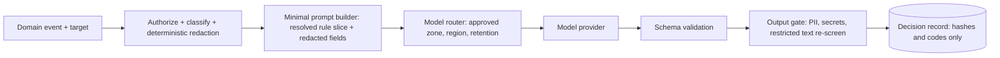

# Safety and privacy

The moderation pipeline is the largest consumer of user text in CAN, so it follows `docs/spec/14-ai-privacy-gateway.md` without exception. This file places those rules in the design.

## Privacy gateway placement

No moderation code calls a provider directly. Only the gateway can construct a model request, and the type of `complete()` accepts only gateway output. A lint rule and an architecture test forbid importing a provider adapter anywhere else.

## Data zones in a run

| Zone (spec 14) | In the moderation run |
|---|---|
| Transient raw intake | Draft text before redaction. Never leaves the server. Deleted per DRAFT-TTL-1. |
| Restricted evidence | Never sent to a model by default. Moderation sees tier and description only. |
| Sanitized AI processing | The only zone a model request may contain: redacted, minimized, token-substituted text. |
| Public knowledge | Published items; used for duplicate and context retrieval (public only). |
| Audit and telemetry | Run records, metrics: hashes, offsets, counts, codes. No text. |

## Zero retention and providers

- A provider enters the register only with the spec 14 approvals: DPA, no training on project data, zero or strictly bounded retention with deletion verification, approved region, tenant isolation, subprocessor list.
- Tests, CI and night runs use the FakeModel and recordings, so no real data reaches any provider.
- **Free endpoints are synthetic-only (D-65).** Free (`:free`) OpenRouter endpoints may log or train on their inputs. They are allowed only for synthetic data: simulation, seeds, evals and record runs. Requests on those paths set `data_collection: "allow"` explicitly and the gateway refuses to send any payload not marked synthetic to them.
- **Real member content** goes only to endpoints with data collection denied: OpenRouter provider routing `data_collection: "deny"`, or zero-data-retention endpoints. The router filters the register by the request's data class before it ranks by price, and never fails over to a weaker endpoint. It always passes through the privacy gateway first.
- Any path that sends real member data stays founder-gated (operational gates below, graduation review 11-u40).
- Order of preference for identifying content: deterministic local, then project-operated inference in an approved region, then a contracted hosted provider.
- Cache and recordings store no raw text (see `runtime.md`); recorded response fixtures are made from synthetic inputs only.

## Redaction and re-identification tests

- **Redaction**: names, contact details, government ids, street addresses with numbers, precise coordinates, secrets, file metadata. Replaced with scoped, expiring tokens (`[PERSON_1]`) whose mapping lives in a separate encrypted store with stricter access and short retention; the model never sees the mapping.
- **Re-identification tests** (per DP, in evaluation): synthetic-PII sets across scripts and languages; rare combinations of role, place and time; adversarial formatting (spacing, homoglyphs, leetspeak, split across fields); outputs checked to never reproduce an input identifier or infer a sensitive attribute. Metrics: redaction recall and harmful over-redaction.
- Pseudonymized data is still personal data; tokens are operation-scoped, not global.

## PII-safe caches and logs

Cache values and run records hold structured results, offsets and hashes only. Keys use a server-side HMAC. Namespaces are per problem for user content. TTLs are short, deletion propagates with the target (drafts, accounts, withdrawal), and cache timing or error behavior is not an identity side channel (spec 15). Ordinary logs hold run ids, outcome codes and counts. Time-bounded encrypted diagnostic capture exists only for an approved incident or evaluation, with expiry.

## Fail-closed matrix

| Failure | Result | Visible to the person |
|---|---|---|
| Provider outage or timeout | `hold`, retry with backoff | "Taking longer than usual", item stays private |
| Schema invalid after repair | `hold`, run flagged | same |
| Confidence below floor after escalation | `hold` (or `needs_revision` if a rule is clearly cited) | same, or hints |
| Unsupported language or script | `hold` with "language not yet supported" (OQ-unsupported-language) | label plus hold |
| Pack missing, invalid, expired approval | `hold` for affected DPs, previous version stays active if valid | same |
| Budget or spend cap reached | `hold` for blocking work; async work deferred | same |
| Injection canary trips | `hold`, run flagged for auditors, no hint text generated from that content | same |
| Gateway or redaction failure | `hold`, no model call | same |
| Policy conflict unresolved (PREC-1) | state unchanged; rights or crisis tier queues to the human lane | same |
| Crisis signal (any DP-CRISIS positive) | not published; static crisis resources shown; lane for imminent danger | crisis resources |
| Moderation entirely down | all publishing stops; crisis route still serves static content (CRISIS-STATIC-1) | pending screen |

Publication fails closed. Safety routing fails open to static resources, because those need no dependency.

## Abuse of the policy process

- **Proposal flooding or capture**: rate limits, duplicate checks, burst detection, randomized panels, no loosening-in-the-same-PR, public history (`amendment-loop.md`).
- **Poisoned labels or examples**: provenance, independent extra labeling, coordination checks, eval disjointness, human review of the diff before ratification. Examples with identifiers are redacted before entering a PR.
- **Prompt injection through appeals or examples**: grounds and label text are untrusted data in a quoted block, like any user text; examples are shown to models only as quoted data too.
- **Gaming through resubmission**: salted fingerprints and the cooldowns of the brief; resubmission after `reject` is compared to detect probing.
- **Adversarial probing of thresholds**: explanations cite rule ids and spans but not scores, floors or other signals. Sampled audit catches systematic evasion.

## Bias monitoring across jurisdictions

- Every eval set and the live sample are stratified by jurisdiction, language, script and affected group; each DP has a parity bound in `thresholds.yaml` (max gap in false-reject and false-accept rates).
- Live dashboards show outcome, hold, overturn and appeal rates per jurisdiction and language. A gap beyond the bound blocks ratification and raises an audit flag.
- Auditor-versus-AI disagreement is tracked per jurisdiction; cross-jurisdiction panels review rules where gaps persist.
- Jurisdiction overlays can only add protection, never weaken the base, so a local pack cannot become a local bias channel.
- Never present AI interpretation as legal advice or a definitive statement of law; DP-LEGALITY outputs say "under pack X, version Y".

## Spend caps

Per DP, per event, per jurisdiction and global daily caps, in micro-USD, set in server config and refused to be missing for live providers. The app-level default is `AI_SPEND_CAP_MONTHLY_USD=10` (D-65), and every live record, persona or eval run also takes its own budget; both sit under the $50 hard limit on the provider key. Cost per accepted result is the main efficiency metric. Reaching a cap sheds work in the order sampling, re-moderation, low-risk updates, and holds blocking work; it never weakens a check. Alerts fire at 50, 80 and 100 percent. Route changes that raise cost need a ratified routing change (`amendment-loop.md`).

## Operational gates before live data

Data-flow diagram, privacy impact assessment, model and provider register, synthetic-PII eval, injection and extraction tests, redaction recall report, outage and breach runbooks, kill switch, independent privacy and security review, explicit founder approval (spec 14 operational gates). All must exist before any real data reaches a live provider. They do not block the slice-1 FakeModel pipeline.
