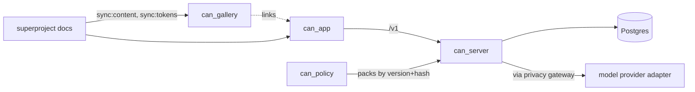

# Components

What the system is made of, per repo, and which plan unit builds each part. Behaviour over time is in [../flows/](../flows/README.md); the overview and ERD are in [../system-design.md](../system-design.md); the AI design is in [../ai/](../ai/README.md).

## Index

| File | Covers | Built today |
|---|---|---|
| [server.md](server.md) | `can_server` modules, layers, AI moderation runtime, AI entities | scaffold: health, `events` table, `domain/{ids,event,protocol}`, config, OpenAPI export |
| [app.md](app.md) | `can_app` providers, query layer, generated client, civic layer, screens, i18n, tokens | scaffold: theme, i18n, typed client, `useHealth`, 5 civic components |
| [gallery.md](gallery.md) | `can_gallery` static pages and synced content | built (Phase 0a in plan 06 continues) |
| [can-policy.md](can-policy.md) | planned 5th repo with policy packs, content schemas, seed packs | not created (founder-gated, D-52) |
| [cross-cutting.md](cross-cutting.md) | ids, events, errors, config, logging, ports | ids and event model built; rest planned |

## Legend
- **built**: files exist. **planned (unit)**: a plan unit specifies it. **plan 09 (pending)**: AI plan. **plan 10 (pending)**: structured content. **plan 11 (pending)**: simulation, seeds, lane. **not yet planned**: no unit exists; a gap to close.
- Repos are four submodules plus the superproject; `can_policy` would be the fifth (D-52).

## Conventions
1. Each component file starts with a mermaid component diagram, then a table: component, responsibility, depends on, built by, status.
2. Status words are only the four above; verify against the repo before changing "built".
3. When a plan unit lands, change its row in the same PR.
4. No em or en dashes; max 25KB per file.

## Whole-system view

