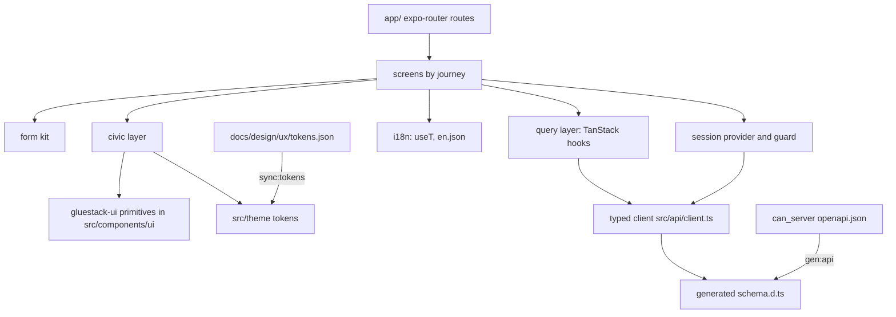

# can_app components

Expo SDK 57, expo-router, React 19.2, RN 0.86, TanStack Query, openapi-fetch, react-intl, zod plus react-hook-form. Web is verified; native only has to bundle (ADR 0005).

| Component | Responsibility | Built by | Status |
|---|---|---|---|
| Routes `app/_layout.tsx`, `index.tsx` | shell and home | scaffold | built (minimal) |
| Providers (query, intl, theme, session) | app-wide context | 02-u13 (client infra), 02-u16 (session) | partly built |
| Query layer | per-endpoint hooks, e.g. `useHealth` | scaffold, then each feature unit | partly built |
| Generated client | `src/api/schema.d.ts` via `npm run gen:api`; `client.ts` binds fetch late; CSRF and error envelope | 02-u13 | partly built |
| Civic layer | `Screen`, `CivicHeading`, `CivicText`, `CivicButton`, `StatusMessage` today; wrappers over gluestack primitives (D-50, ADR 0007) | 02-u24, 02-u25 | built (RN core), gluestack migration planned |
| Form kit | fields, inline validation, focus first error | 02-u14 | planned |
| Nav shell | tabs or top bar, skip link, emergency notice | 02-u15 | planned |
| Session provider | guard, session-expired sheet | 02-u16 | planned |
| Local draft store | autosave before sign-in | 03-u16 | planned |
| i18n | `useT()`, typed `MessageId`, ICU, ids from copy deck | scaffold | built |
| Tokens | `sync:tokens` copies the design source | scaffold | built |

## Screens by journey
| Journey | Screens | Units |
|---|---|---|
| Auth and onboarding | WF-SIGNUP-1, WF-SIGNIN-1, WF-SIGNIN-2, WF-ONBOARD-1, WF-SESSION-1 | 02-u16 to 02-u18 |
| Browse | WF-LIST-1, WF-DETAIL-1, WF-DETAIL-2, WF-DETAIL-3 | 02-u19, 02-u20, 05-u06 |
| J1 submitter | WF-SUBMIT-1 to 7, WF-PENDING-1, WF-DECISION-1, WF-DECISION-2, WF-APPEAL-1, WF-MYACT-1, WF-EXTERNAL-1 | 03-u17 to 03-u22, 05-u07 |
| J2 contributor | WF-CONTRIB-1, 2, WF-PROPOSAL-1, 2, WF-DECREC-1, WF-TASK-1, 2, WF-RESOLUTION-1 | 04-u08 to 04-u10, 05-u05, 05-u07 |
| J3 moderator (obsolete under D-51) | WF-MOD-QUEUE-1, WF-MOD-REVIEW-1, WF-MOD-APPEAL-1, WF-MOD-INVITE-1 | 03-u23 to 03-u25 |

Under D-51 the moderator screens change role: invite issuing stays; review and appeal screens become auditor and labeler screens (sampled decisions, masked label tasks) plus the policy change history view. These screens and their wireframes are not yet planned; see [../ux/journeys.md](../ux/journeys.md) J3 for what they replace. The user-facing decision screens gain a "re-reviewed under policy vX" notice and the independent re-run status.

## Rules that matter for design
Feature code imports UI only from `src/components/civic`; API access only through `src/api/client.ts`; every string through `useT()`; logical properties only; colours from tokens. Details: skill `can-app`.
