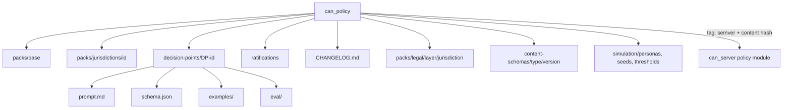

# can_policy (planned 5th repo)

Home of the community-legislated moderation policy (D-52). The server loads packs by version and hash. Contributors change moderation by pull request here.

Status: not created. Creating the GitHub repo is a founder-gated plan unit; until then packs live as fixtures inside `can_server` for tests. Layout and contents of a pack are specified in [../ai/policy-pack.md](../ai/policy-pack.md); this file only places the repo in the system.

## Structure
| Path | Holds |
|---|---|
| `packs/base/` | platform rules, thresholds |
| `packs/jurisdictions/<id>/` | jurisdiction rules overlay (local platform rules, enabled languages) |
| `packs/legal/<layer>/<jurisdiction>/` (for example `L2-supranational/nl/`, `L6-city/nl-amsterdam/`) | versioned legal corpora, each with `corpus.yaml` provenance (LEGAL-SRC-1), `articles/` with stable ids, `topic-index.json` and `review/`; one per layer of the cumulative stack (D-61): L1 UN human rights (UDHR, ICCPR, ICESCR), L2 supranational where binding (NL: EU Charter, EU law, ECHR), L3 national constitution, L4 national law, L5 regional, L6 city; L0 is the base platform pack. Official publisher text only, hash pinned into the pack hash (legal-source integrity, constitution IV.6). Maintained by lawyers and rights experts through PRs: [../flows/legal-corpus-update.md](../flows/legal-corpus-update.md) |
| `decision-points/<DP-id>/prompt.md` | one prompt template per DP |
| `decision-points/<DP-id>/schema.json` | output schema |
| `decision-points/<DP-id>/examples/` | labeled examples (appeal labels land here) |
| `decision-points/<DP-id>/eval/` | eval sets |
| `content-schemas/<type>/schema.json` | one versioned schema per content type (D-58): fields, `x-ui`, `x-guidance`, `x-checks`; the app renders forms from it and DP-COMPLETENESS reads it. See [../ai/structured-content.md](../ai/structured-content.md) |
| `simulation/` | persona definitions, seed scenarios 1 and 2 (real framings, synthetic evidence, D-56) and `thresholds.yaml` graduation values; data only, the harness code lives in `can_server/test/simulation`. See [../ai/simulation.md](../ai/simulation.md). The Amsterdam overlay lives in `packs/jurisdictions/nl-amsterdam/` |
| `ratifications/` | ratification records |
| `CHANGELOG.md` | human-readable version history |

Layer order when composed: base platform, constitution, jurisdiction law, local rules (constitution I.2). RULE-IDs currently in `docs/spec/constitution/rules.md` move here over time.

## CI
Schema lint (including content-schema compatibility and migration maps), eval against labeled sets with per-DP thresholds, replay diff against fixtures (what would flip). See [../flows/policy-amendment.md](../flows/policy-amendment.md). Releases are tags; the content hash is checked by `can_server` at load.

## Consumers
`can_server` policy module (pack loader, content-schema registry, seed loader); the simulation harness reads `simulation/`, `can_gallery` (rules shown publicly, via sync, planned), `can_app` (`GET /v1/rules` reads server-side copy of the active pack).

## Gaps (not yet planned)
Repo creation unit, can-root submodule wiring (`.gitmodules`, verify-all, skill `can-root`), CI workflow, ratification panel tooling, ADR superseding 0001 (three submodules) and 0006.
