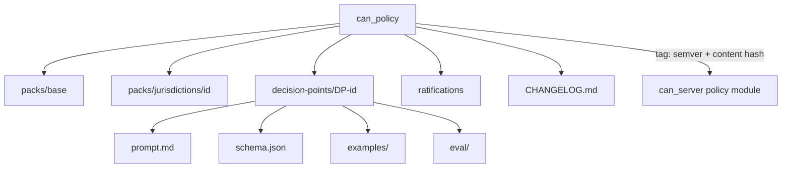

# can_policy (planned 5th repo)

Home of the community-legislated moderation policy (D-52). The server loads packs by version and hash. Contributors change moderation by pull request here.

Status: not created. Creating the GitHub repo is a founder-gated plan unit; until then packs live as fixtures inside `can_server` for tests. Layout and contents of a pack are specified in [../ai/policy-pack.md](../ai/policy-pack.md); this file only places the repo in the system.

## Structure
| Path | Holds |
|---|---|
| `packs/base/` | platform rules, thresholds |
| `packs/jurisdictions/<id>/` | jurisdiction law overlay |
| `decision-points/<DP-id>/prompt.md` | one prompt template per DP |
| `decision-points/<DP-id>/schema.json` | output schema |
| `decision-points/<DP-id>/examples/` | labeled examples (appeal labels land here) |
| `decision-points/<DP-id>/eval/` | eval sets |
| `ratifications/` | ratification records |
| `CHANGELOG.md` | human-readable version history |

Layer order when composed: base platform, constitution, jurisdiction law, local rules (constitution I.2). RULE-IDs currently in `docs/spec/constitution/rules.md` move here over time.

## CI
Schema lint, eval against labeled sets with per-DP thresholds, replay diff against fixtures (what would flip). See [../flows/policy-amendment.md](../flows/policy-amendment.md). Releases are tags; the content hash is checked by `can_server` at load.

## Consumers
`can_server` policy module (pack loader), `can_gallery` (rules shown publicly, via sync, planned), `can_app` (`GET /v1/rules` reads server-side copy of the active pack).

## Gaps (not yet planned)
Repo creation unit, can-root submodule wiring (`.gitmodules`, verify-all, skill `can-root`), CI workflow, ratification panel tooling, ADR superseding 0001 (three submodules) and 0006.
