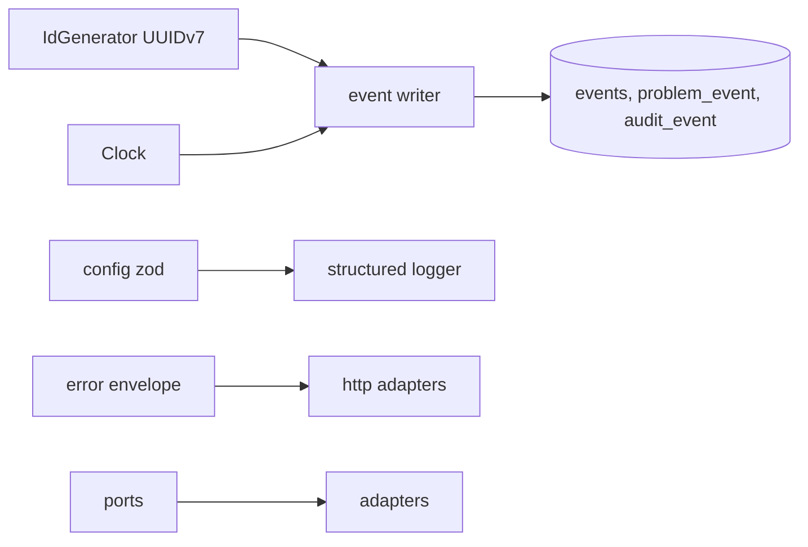

# Cross-cutting components

Shared kernel in `can_server/src/platform` and `src/domain`. Keep tiny.

| Piece | Rule | Status |
|---|---|---|
| Ids | UUIDv7, generated in app by `IdGenerator`; no hostnames in ids | built (`domain/ids.ts`) |
| Events | append-only; id, object id and type, event type, `origin_node_id`, actor, `occurred_at`, `protocol_version`, payload, nullable `prev_hash` always null; state change and event in one transaction; app DB role has no UPDATE or DELETE | model built (`domain/event.ts`, `events` table); same-transaction engine 03-u05; grants 02-u04 |
| Event naming | `<subject>.<verb>` strings, versioned with `protocol_version`; AI events: `moderation.run.completed`, `moderation.held`, `policy.version.ratified` | planned, plan 09 (pending) for AI |
| Errors | `{error:{code,message,fieldErrors?}}`, stable codes (`invalid_transition`, `not_permitted`, `session_expired`, `conflict`) | planned 02-u03 |
| Config | zod-validated env, fails at boot, `.env.example` lists names; AI keys and spend caps only from env | partly built (`config.ts`), hardening 02-u02 |
| Logging | structured JSON with request id; never email, codes, tokens, body text; redaction list tested; prompts and model outputs follow the same rule unless stored in `moderation_run` by design | planned 02-u02 |
| Pagination | `{items,nextCursor}`, limit default 20 max 50 | planned 02-u03 |
| Idempotency | `Idempotency-Key` on mutations | planned |
| Ports | `IdentityPort`, `StoragePort`, `SigningPort` (`NoSigner`), `NotificationPort` (SMTP to Mailpit), `JobPort` (Postgres rows), plus `AiGatewayPort` (replaces `NoopAiGateway`, D-51) | interfaces planned; `AiGatewayPort` plan 09 (pending) |
| Rate limits | Postgres-backed on every write path | planned 07-u02 |
| Sensitivity | secret, restricted, internal, public enforced in use cases | planned |

## Portability (D-57)
Hosting is undecided, so every service must run anywhere. All plan 11 (pending).

- **Images:** a production Dockerfile per service (`can_server`; `can_gallery` static files behind any static server; `can_app` web export), multi-stage, non-root, pinned base, no dev dependencies, no secrets baked in.
- **Env contract:** every variable is in the table below and in `.env.example`; config is zod-validated and fails at boot.
- **Health:** `GET /v1/health` (liveness, no dependencies) and `GET /v1/ready` (DB reachable, migrations current, active policy pack loaded and hash-checked).
- **Backup and restore:** documented Postgres dump and restore with a tested restore script; the pack is rebuilt from `can_policy` tags, so only the database needs backup.
- **No host-specific assumptions:** no cloud SDK in domain code; email, storage and jobs behind ports; migrations are an explicit step; graceful shutdown on SIGTERM; logs to stdout.

| Variable | Service | Purpose |
|---|---|---|
| `DATABASE_URL` | server | Postgres connection |
| `PORT`, `PUBLIC_BASE_URL` | server | listen port, links in email |
| `EMAIL_ENC_KEY`, `EMAIL_INDEX_KEY` | server | email encryption and blind index |
| `MAIL_TRANSPORT`, `SMTP_URL`, `MAIL_FROM` | server | notification port |
| `POLICY_PACK_SOURCE`, `POLICY_PACK_VERSION`, `POLICY_PACK_HASH` | server | which pack to load, hash check |
| `AI_PROVIDER` (`fake` default, `anthropic`), `ANTHROPIC_API_KEY`, `AI_SPEND_CAP_DAILY` | server | live AI stays off unless all are set (founder-gated) |
| `COOKIE_SECURE`, `ALLOWED_ORIGINS` | server | web session and CSRF |
| `EXPO_PUBLIC_API_BASE_URL` | app | API location at build |
| `NEXT_PUBLIC_APP_URL` | gallery | link target at build |

Related: [server.md](server.md), [../flows/background-jobs.md](../flows/background-jobs.md), [../system-design.md](../system-design.md).
