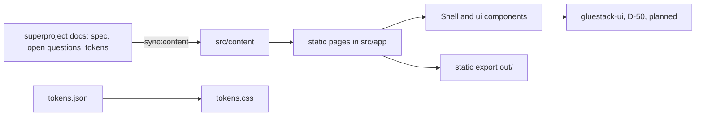

# can_gallery components

Static Next.js 16 export. No runtime, no API calls, no forms, no analytics. Its job is to explain CAN honestly and win developers; it links to the app and repository.

| Component | Responsibility | Built by | Status |
|---|---|---|---|
| Pages: home, how-it-works, principles, roadmap, open-questions, contribute | public explainer | plan 06 | built (copy continues) |
| `src/content/{stages.ts,open-questions.json,tokens.json}` | synced or owned content | plan 06 | built; `sync:check` guards drift |
| `Shell.tsx`, `ui.tsx` | layout and primitives | plan 06 | built (plain CSS) |
| gluestack theme and migration | D-50 | 06-u15, 06-u16 | planned |
| Locale routing, task catalog, role pages, decisions page, what's new | richer content | 06-u02 to 06-u07 | planned |
| Moderation explainer content | must say: community writes the policy, AI applies it, humans audit and label, emergency and legal lane is human | not yet planned | gap: copy must follow D-51 (see also 06-u01 claims audit) |
| Deploy | static host | 06-u13, 06-u14 | planned |

The "AI assistance is planned; people make and answer for every decision" wording in the old public copy is superseded by D-51 and must be corrected through the claims audit before deploy.
