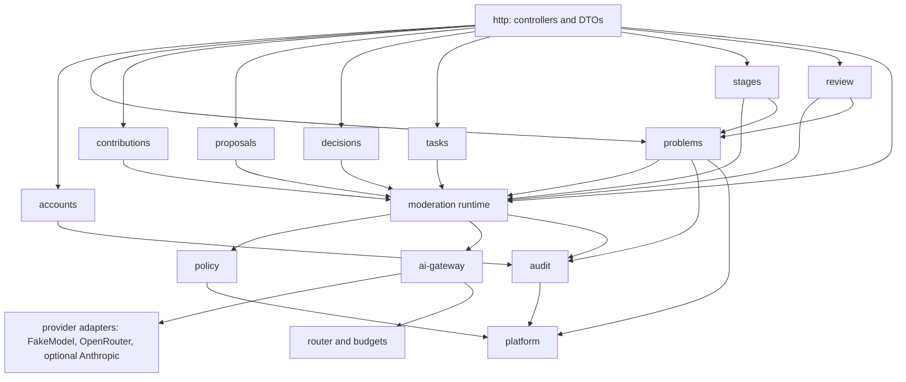
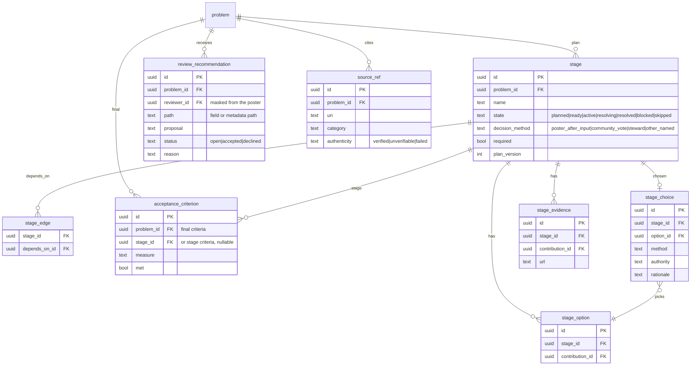
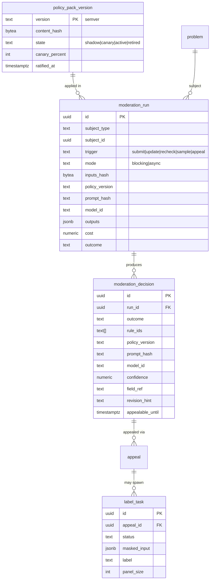

# can_server components

NestJS 12 modular monolith, Drizzle, Postgres 16. Layers inside each module: `http/` (controllers, zod DTOs) calls `app/` (use cases) calls `domain/` (pure TS) and `infra/` (Drizzle repos, adapters behind ports). `domain/` must not import `@nestjs/*`, `drizzle-orm` or `infra/` (lint rule, planned 02-u03). Dependency direction is one way; cross-module calls use exported use-case interfaces, never another module's tables.

## Built today
`src/main.ts`, `app.module.ts`, `app.setup.ts`, `config.ts`, `openapi.ts`, `health/{controller,dto,module}`, `db/{schema,db.module}` (one table: `events`, append-only), `domain/{ids,event,protocol}`. Everything below this line is planned.

## Module map

| Module | Responsibility | Depends on | Built by | Status |
|---|---|---|---|---|
| `platform` | config, health, clock, IdGenerator (UUIDv7), event log writer, `JobPort` runner, ports | none | 02-u02, 02-u03, 03-u14 | partly built (config, health, ids, event) |
| `accounts` | account, session, invite, handle, email crypto, login codes | audit, notification port | 02-u04 to 02-u08, 03-u15 | planned |
| `problems` | problem, problem_event, transition engine, jurisdiction, draft_fingerprint, deterministic submission checks | accounts, moderation, audit | 02-u09 to 02-u12, 03-u01 to 03-u08 | planned |
| `moderation` | **AI moderation runtime orchestrator**: DP selector, run recorder, decision applier, outcome mapper, hold-and-retry, appeal re-run | problems, policy, ai-gateway, audit | plan 09 (pending); today 03-u09, 03-u10 (human queue, superseded) | plan 09 (pending) |
| `policy` | pack loader, version registry (semver + hash), active and rollout state, cache keyed by version | platform | plan 09 (pending) | plan 09 (pending) |
| `ai-gateway` | privacy gateway (redact, pseudonymize, zones), provider adapters (FakeModel, OpenRouter, optional Anthropic), router (small model first), budgets and spend caps, model register | policy, platform | plan 09 (pending) | plan 09 (pending) |
| `stages` | stage plan DAG (`stage`, `stage_edge`, `acceptance_criterion`), gating engine, `stage_option`, `stage_choice`, `stage_evidence`, plan versions and plan-change proposals | problems, moderation, contributions | W10 (D-72) | planned |
| `review` | volunteer opt-in, review queue with masked view, `review_recommendation`, poster resolution, quorum check that triggers DP-PUBLISH | problems, moderation, accounts, ai-gateway (masking) | W10 (D-72) | planned |
| `contributions` | contribution, evidence_ref (URL only), allowed-per-state matrix | problems, moderation | 04-u01 to 04-u03 | planned |
| `proposals` | proposal, comparison data | problems, contributions | 04-u04 | planned |
| `decisions` | decision_record, legal-gate record | proposals, problems | 04-u05 | planned |
| `tasks` | task, blockers, verification refs | decisions, problems | 05-u01, 05-u02 | planned |
| `audit` | audit_event, write-only API for others | none | 02-u04 | planned |

Added by D-55 to D-58 (all pending plans 09, 10, 11):

| Part | Responsibility | Depends on | Status |
|---|---|---|---|
| Content-schema registry (inside `policy`) | serves schema JSON by content type and version from the active pack; validates submissions against the pinned `schema_version`; refuses hash mismatch; `GET /v1/content-schemas/{type}?version=` | policy loader | plan 10 (pending) |
| Fill-assist endpoint | `POST /v1/content-schemas/{type}/assist`: notes through the privacy gateway, schema-constrained per-field suggestions, nothing stored as content | ai-gateway, registry | plan 10 (pending) |
| DP-COMPLETENESS, DP-ASSUMPTIONS | two more DPs in the selector, run on every structured content type; own prompts, schemas and eval sets in the pack | moderation | plan 09 (pending) |
| Notices read model | per-account "re-reviewed under policy vX", "Decided under policy vX" and re-resolution notices built from decisions; `GET /v1/me/notices` | moderation | plan 09 (pending) |
| `label_task` module | randomized, context-masked appeal and eval label pools, disagreement tracking, label export as pack PR input | moderation, accounts (labeler role) | plan 09 (pending) |
| `lane` module | emergency and legal lane cases, logged actions by lane members; the only per-case human decision | moderation, audit | plan 09 (pending) |
| Legal corpora registry, topic index, article retrieval (inside `policy`) | loads versioned legal corpora per layer L0 to L6 and jurisdiction with source provenance and hash; topic index maps problem topics to the articles that apply; retrieval returns the exact article text and source for a legality DP (the model never recalls law from memory); `GET /v1/legal/{jurisdiction}/layers` | policy loader | plan 09/10 (pending) |
| Re-resolution review job | on policy or corpus change, replays past resolutions through DP-RERESOLUTION and applies keep, annotate or reopen | moderation, problems, jobs | plan 09/10 (pending) |
| Simulation harness | persona runner driving the public API; see below | none in-process | plan 11 (pending) |

### Where the simulation harness lives
Decision: `can_server/test/simulation`, a plain TypeScript runner (Vitest-launched in CI, a `node` script for night runs) that talks to a running server over HTTP only. Why: it needs the public API, FakeModel bindings, fixtures and the test database that already live in `can_server`; a separate package adds a repo, versioning and duplicated fixtures for no gain. The HTTP-only rule (the runner imports no server internals) keeps moving it out cheap later. It runs against its own database, never production. Detail: [../flows/persona-simulation-run.md](../flows/persona-simulation-run.md), [../ai/simulation.md](../ai/simulation.md).

## Lifecycle v2 modules (D-72)
Flows: [problem-preparation](../flows/problem-preparation.md), [volunteer-review](../flows/volunteer-review.md), [publication-decision](../flows/publication-decision.md), [stage-advancement](../flows/stage-advancement.md), [stage-work](../flows/stage-work.md), [plan-change](../flows/plan-change.md).

`stages` module:
- Domain (pure TS): DAG validation (no cycle, no dangling edge, start node, criteria on every stage), gating function `readyStages(plan, states)`, stage state machine (`planned`, `ready`, `active`, `resolving`, `resolved`, `blocked`, `skipped`), `classic-5` template.
- Gating engine (app): after any stage change, in one transaction and under a row lock on successors, recompute `planned` to `ready` (STAGE-GATE-1), and request DP-VERIFICATION when all required stages are resolved.
- Options, choices, evidence: `stage_option`, `stage_choice` (method, authority, rationale), `stage_evidence`; resolve requests call DP-STAGE-RESOLUTION through `moderation` (STAGE-RESOLVE-1).
- Plan changes: versioned plans, `plan_version` optimistic check, DP-STAGE-PLAN (PLAN-CHANGE-1).

`review` module:
- Opt-in flag per account, queue of `in_review` problems, masked view built through the privacy gateway, `review_recommendation` lifecycle (`open`, `accepted`, `declined` with reason, RECO-1), quorum check (default for `OQ-review-quorum`: 3 finished reviews, none open over 7 days; poster may proceed after 14 days with 1), then enqueue DP-PUBLISH. Review content is never public (REVIEW-1).

Additional endpoints (plan with W10, exact shapes in the spec): `PUT /v1/problems/{id}/stage-plan`, `GET /v1/problems/{id}/stages`, `POST /v1/stages/{id}/options|choice|evidence|resolve`, `POST /v1/problems/{id}/plan-changes`, `GET /v1/review/queue`, `POST /v1/review/{problemId}/recommendations`, `POST /v1/recommendations/{id}/resolve`, `POST /v1/me/review-opt-in`.

### Lifecycle v2 entities

Visibility: all of these are private until publish; `review_recommendation` stays private after publish (REVIEW-1). Stage rows, edges, criteria, options, choices, evidence and source refs become public with the problem. `task` gains `stage_id`, `contribution` gains nullable `stage_id`, `decision_record` records a `stage_choice`.

## Inside moderation, policy and ai-gateway

| Part | Notes |
|---|---|
| DP selector | maps event type plus content kind to the DP set in the active pack. Provisional DP ids in [../ai/decision-points.md](../ai/decision-points.md). |
| Run executor | classify, rule checks, explain, then aggregate deterministically. Agents have no tools; content is quoted data; outputs schema-bound. |
| Privacy gateway | redaction, pseudonymization, data zones, zero-retention providers; no provider call without it. See [../ai/safety-and-privacy.md](../ai/safety-and-privacy.md). |
| Router and budgets | cheapest eval-passing model per DP from the model register, fallback chain on 429 or outage, escalate on low confidence, $10/month app cap and per-run caps, cost per accepted result metric. |
| Adapters | `FakeModel` (deterministic, recorded responses; tests and night runs). `OpenRouter` adapter (D-65) needs `OPEN_ROUTER_KEY` and a spend cap; not founder-gated within the caps, off unless `AI_PROVIDER=openrouter`. Optional `Anthropic` adapter. In dev, config loads the superproject `../.env` as a fallback when the variable is not already in the environment (never in production), reads only the names it needs and never logs a value. |
| Decision applier | writes decision and the transition in one transaction through the engine. `hold` on any failure. |
| Policy loader | loads a pack by version and hash, refuses on mismatch, keeps the previous active version; cache keyed by policy version plus normalized input hash. See [../ai/policy-pack.md](../ai/policy-pack.md). |

Runtime detail lives in [../ai/runtime.md](../ai/runtime.md); this file only places it among modules.

## AI entities (sketch)

`moderation_decision` replaces the human-decider columns of the older ERD (`decided_by`, `interim`, `reviewer_disclosure` are gone or system-actor). `appeal.reviewer_id` becomes the independent run id. The `events` scaffold table carries run events by `object_type`.

## HTTP surface changes under D-51
`POST /v1/moderation/decisions` and the moderator queue and appeals queue endpoints in system-design section 6 are replaced by: read decisions and runs for my problem, file appeal, read notices, and (for auditors and labelers) sample and label endpoints. Exact paths come with plan 09.

## Tests
Domain units in Vitest (no Nest), e2e against compose Postgres and Mailpit, FakeModel with recorded responses for every DP; no paid calls in CI or night runs.
