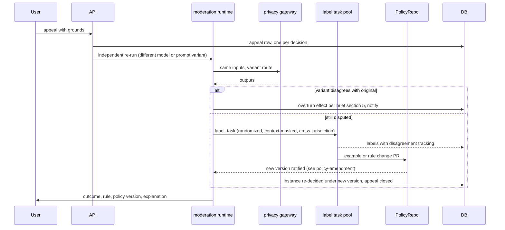

# Flow: appeal-to-example loop

## Purpose
A person who disagrees with an AI decision gets an independent re-run, then a community label if still disputed. The label becomes a policy change, and the instance is re-decided by AI under the new version. Humans do not override single instances (D-51).

## Trigger
`POST /v1/moderation/decisions/{id}/appeals` before `appealable_until`.

## Status
planned. Filing and statuses: 03-u12, 03-u13 (written for human reviewers, to be reworked); loop plan 09 (pending).

## Sequence

Screens: WF-APPEAL-1, WF-APPEAL-2 (appellant timeline), WF-LABEL-1 (labeler).

## Failure paths
- Window closed: `appeal_window_closed`, no row.
- Independent run cannot complete: appeal stays open, retried; never auto-upheld.
- Labelers (a human role, masked and randomized) split: recorded as disagreement; goes to the amendment loop as an ambiguous-rule signal, instance stays decided as is with an explanation.
- Appeal on an emergency or legal item: routed to [emergency-legal-lane.md](emergency-legal-lane.md).

## Data written
`appeal`, `moderation_run` (variant), `label_task`, label rows, `moderation_decision` (re-decision), `audit_event`.

## Events emitted
`appeal.filed`, `appeal.rerun.completed`, `label_task.created`, `appeal.resolved`, then the effect events of the brief's overturn table (planned).

## DPs invoked
The DP whose decision is appealed, on the variant route. See [../ai/appeals.md](../ai/appeals.md).

## Related
[policy-amendment.md](policy-amendment.md), spec brief section 5, constitution rule `APPEAL-1` (now satisfied by an independent model or prompt, not a different moderator).
