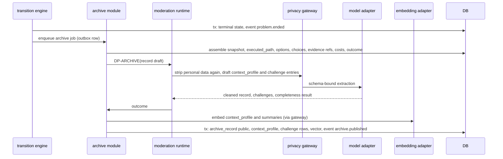

# Flow: archive on terminal state

## Purpose
Keep every problem that ends, with its full journey, in the public Archive (D-76, rule ARCHIVE-1). Failures, blocks and abandoned paths are kept on purpose: they are what lets the next community avoid a dead end.

## Trigger
A problem reaches a terminal transition: `solved`, `closed`, `redirected`, or `stuck` when it is declared ended. A reopen (T23, T24) does not delete the record; a later end creates a new `archive_record` linked to the earlier one. Transition ids come from the spec lifecycle table, not restated here.

## Status
planned, W12 (D-76). Replaces "resolution record" creation in [task-and-verification.md](task-and-verification.md) and [stage-advancement.md](stage-advancement.md).

## Sequence

## Steps
1. The terminal transition commits first. Archiving never delays or blocks the state change.
2. The job builds the record from structured data already in the database: the problem snapshot, the stage plan as executed (`executed_path`: each stage's outcome, duration band, cost band), options considered, the choice and its reason, evidence references, costs and resources, the outcome and the final criteria result, the terminal state, and the policy, schema and legal-corpus versions in force.
3. DP-ARCHIVE runs the privacy gateway again over every free-text field (names, contacts, exact places), checks the record is complete, and captures `challenge` entries from rejected options, blocked stages (DP-BLOCKER), declined recommendations, failed resolutions and appeals.
4. A `context_profile` is built (type, category, scale, geography and climate class, resource band, institution roles, legal layers in force, language, constraints) and indexed for retrieval ([path-suggestion.md](path-suggestion.md)).
5. The `archive_record` becomes public with its license and attribution (default CC BY 4.0, `OQ-contribution-license`). The gallery may show it.

## Failure paths
- DP-ARCHIVE cannot finish, privacy stripping fails, or the gateway is down: the record stays `pending` and private, the job retries with backoff, and nothing personal is ever published. The problem page shows no archive link until it is public.
- Incomplete record (missing outcome or executed path): `needs_attention` for a maintainer; the problem itself is unaffected.
- Embedding provider down: the record publishes without a vector and the index job retries; structured and full text search still find it.
- Duplicate trigger: the job is idempotent per (problem, ended_at).

## Data written
`archive_record`, `context_profile`, `executed_path`, `challenge`, `moderation_run`, `audit_event`, vector row in the context index.

## Events emitted
`problem.ended`, `archive.published`, `archive.held` (planned).

## DPs invoked
DP-ARCHIVE ([../ai/archive-reuse.md](../ai/archive-reuse.md), [../ai/decision-points.md](../ai/decision-points.md)).

## Related
[stage-advancement.md](stage-advancement.md), [re-resolution.md](re-resolution.md), [../components/server.md](../components/server.md), screens WF-ARCHIVE-1 and WF-ARCHIVE-2 in [../ux/wireframes/archive.md](../ux/wireframes/archive.md).
