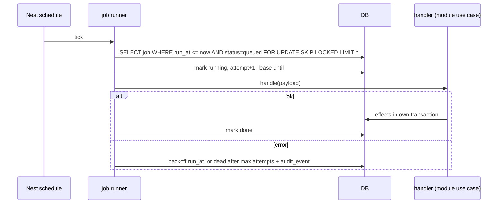

# Flow: background jobs

## Purpose
Run scheduled and queued work without a queue service: a Postgres job table claimed with `FOR UPDATE SKIP LOCKED`, driven by a Nest schedule tick, behind `JobPort`.

## Trigger
Schedule tick (cron expressions in config) or a use case enqueuing a job.

## Status
planned: retention jobs 03-u14 (draft purge, fingerprint expiry, idle revisions, reminders). Moderation retry and re-moderation batches: plan 09 (pending). Not built; `platform` has no job code yet.

## Sequence

Job kinds:

| Kind | Does | Plan |
|---|---|---|
| `retention.draft_purge` | hard-delete bodies at `purge_after` | 03-u14 |
| `retention.fingerprint_expire` | delete fingerprints after 90 days | 03-u14 |
| `retention.session_login_code` | delete expired sessions and codes | 03-u14 |
| `draft.reminder` | day 23 reminder, day 30 T07 | 03-u14 |
| `moderation.retry_hold` | re-run held items | plan 09 (pending) |
| `moderation.recheck_batch` | chunked re-moderation by cursor | plan 09 (pending) |
| `moderation.sample_audit` | draw audit sample | plan 09 (pending) |

## Failure paths
- Handler crash mid-run: lease expires, another tick reclaims; handlers are idempotent.
- Retries exhausted: job `dead`, audit event, visible on an admin health read.
- Two replicas: `SKIP LOCKED` prevents double work.
- Spend cap hit: model jobs are deferred, deterministic jobs continue.

## Data written
`job` rows (kind, payload, run_at, status, attempts, lease, last_error), effects of each handler.

## Events emitted
Per handler (for example `problem.withdrawn` at T07, system actor). Runner itself writes `job.dead` audit events.

## DPs invoked
Only via moderation job kinds. See [../ai/triggers.md](../ai/triggers.md).

## Related
[post-publication-recheck.md](post-publication-recheck.md), [components/cross-cutting.md](../components/cross-cutting.md).
