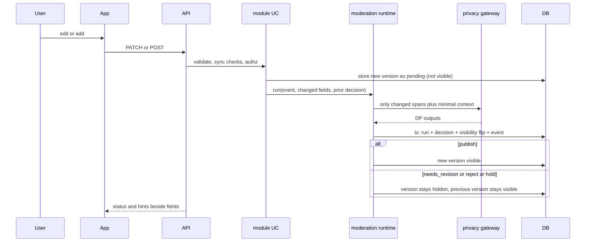

# Flow: content update

## Purpose
Any edit or addition to public-capable content (problem fields after needs_revision, contributions, proposals, task updates, decision records) is moderated before it becomes visible. Runs are diff-aware: only changed fields and their context go through the DPs.

## Trigger
`PATCH /v1/problems/{id}`, `POST /v1/problems/{id}/contributions`, `PATCH /v1/contributions/{id}`, proposal and task endpoints.

## Status
planned. Endpoints: 03-u06, 04-u02, 04-u04, 05-u01. Contribution moderation: 04-u03 (human review today, to be reworked to a run). Diff-aware run: plan 09 (pending).

## Sequence

## Failure paths
- Run fails or times out: fail closed, new version stays pending (`hold`), previous public version unchanged; retry job.
- Reject: hidden with rule cited, appealable ([appeal.md](appeal.md)); author keeps the text.
- Allowed-per-state check (brief section 6) fails: 409 before any run.
- Edit during an open appeal: edit rejected, appeal refers to a fixed version.

## Data written
New content version row, `moderation_run`, `moderation_decision`, `audit_event`.

## Events emitted
`content.updated`, `moderation.run.completed`, `content.published` or `content.held` (planned).

## DPs invoked
DP-PRIVACY, DP-NAMING, DP-RELEVANCE (contribution relevance and solution-only), DP-TONE (tone and escalation risk), DP-DUPLICATE for contributions; DP-LAWFULNESS for proposals; DP-DECISION-RECORD for decision records. See [../ai/decision-points.md](../ai/decision-points.md). Blocking.

## Related
[contribution-and-proposal.md](contribution-and-proposal.md), [post-publication-recheck.md](post-publication-recheck.md).
