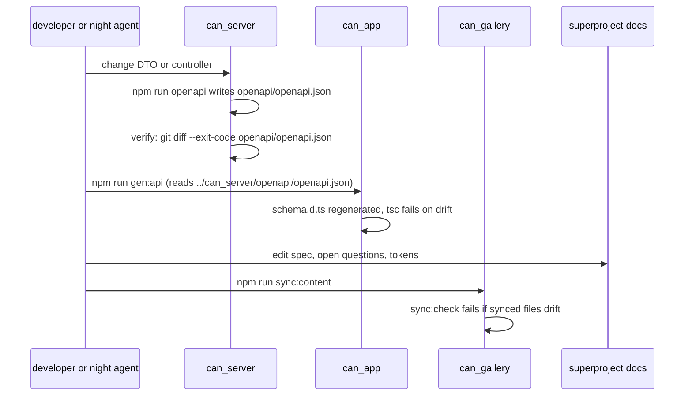

# Flow: contract (server openapi, app client, gallery sync)

## Purpose
One owner for the API contract (ADR 0002) and one owner for synced public content, so clients never drift.

## Trigger
A change to a controller or DTO in `can_server`; a change to synced spec or design sources.

## Status
partly built. `can_server/openapi/openapi.json` exists and `npm run verify` diffs it. `can_app` runs `npm run gen:api` (openapi-typescript into `src/api/schema.d.ts`). `can_gallery` has `sync:content` and `sync:check`. Staleness gate in CI: planned 08-u04 to 08-u07.

## Sequence

## Failure paths
- Stale `openapi.json`: server verify fails; commit the regenerated file.
- Client compiles against old schema: `tsc --noEmit` in app verify fails after regeneration.
- Breaking change: needs `/v2` or an additive field.
- Gallery never calls the API; there is no runtime contract with it.

## Data written
Generated files only: `openapi/openapi.json`, `src/api/schema.d.ts`, `src/content/*` in gallery.

## Events emitted
None.

## DPs invoked
None.

## Related
[system-design section 7](../system-design.md), [components/app.md](../components/app.md), [components/gallery.md](../components/gallery.md), [ADR 0002](../../adr/0002-server-owned-openapi.md).
