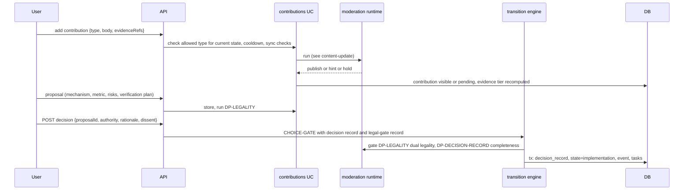

# Flow: contribution, proposal and decision record

> **D-72 (W10):** the fixed stages (facts, solutions, choosing, in progress) are replaced by stage nodes. Contributions and proposals target a stage (`stage_option`); the choice is a `stage_choice` with the stage's decision method ([stage-work.md](stage-work.md)). The old T08 to T11 below read as ST05 and CHOICE-GATE per stage. Contributions to a `planned` stage are allowed and kept ready (STAGE-PREP-1); they surface when the stage becomes `ready`. The allowed-type matrix is per stage, not per problem state.

## Purpose
Move a problem from facts to a chosen fix: typed contributions, comparable proposals, a decision record with authority, rationale and a legality check.

## Trigger
`POST /v1/problems/{id}/contributions`, `.../proposals`, `.../decision`, plus stage transitions ST05 and the choice gate.

## Status
planned: 04-u01 to 04-u07 (server), 04-u08 to 04-u11 (app). Moderation of contributions in 04-u03 assumes human review; plan 09 (pending) replaces it with a run.

## Sequence

## Failure paths
- Type not allowed in the state: 409 before any run.
- Lawfulness fails or unsure: outcome `needs_revision` with hint, or the problem goes `stuck` per T13 with the blocking constraint named; `hold` on model failure.
- Decision record incomplete: DP-DECISION-RECORD returns `needs_revision`; the choice gate does not pass.
- Duplicate: `duplicate_of` link (04-u06) via DP-DUPLICATE, then T16.

## Data written
`contribution`, `evidence_ref`, `proposal`, `decision_record`, `task`, `moderation_run`, `moderation_decision`.

## Events emitted
`contribution.added`, `contribution.published`, `proposal.created`, `decision.recorded`, `problem.implementation` (planned).

## DPs invoked
DP-COMPLETENESS and DP-ASSUMPTIONS (every contribution, proposal and decision record is schema-structured, [structured-submission.md](structured-submission.md)), DP-CONTRIB-RELEVANCE, DP-TONE, DP-PRIVACY, DP-NAMING, DP-LEGALITY, DP-DECISION-RECORD, DP-EVIDENCE-TIER, DP-DUPLICATE. See [../ai/decision-points.md](../ai/decision-points.md).

## Related
[content-update.md](content-update.md), [lifecycle-transition.md](lifecycle-transition.md), [ux/journeys.md](../ux/journeys.md) J2.
