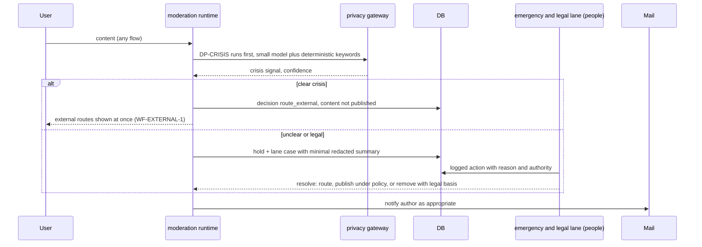

# Flow: emergency and legal lane

## Purpose
The only place a person acts on a single case. Crisis or immediate-danger content is routed to external emergency services and shown a route at once; legal or law-enforcement requests (takedown orders, court orders, data requests) are handled by a small, named, logged lane.

## Trigger
1. DP-CRISIS returns `route_external` or `escalate_human` during any run.
2. A legal request arrives through the documented channel and an authorized person opens a lane case.

## Status
plan 09 (pending). Real emergency routes with reviewed legal text: 05-u09, founder-gated (open questions on emergency routing and legal review). Fictional routes only until then.

## Sequence

## Failure paths
- Gateway down: crisis keywords still run deterministically before any model; the routes are shown without a model.
- Lane unattended beyond its target: case ages visibly to maintainers; content stays held, never published.
- Every lane action is itself audited and sampled by auditors; the lane cannot edit policy.

## Data written
`moderation_run`, `moderation_decision` (outcome `route_external` or `escalate_human`), `lane_case`, `audit_event` with actor, authority and reason.

## Events emitted
`moderation.routed_external`, `lane.case.opened`, `lane.case.resolved` (planned). Lane events are append-only and exempt from nothing.

## DPs invoked
DP-CRISIS. See [../ai/safety-and-privacy.md](../ai/safety-and-privacy.md) and [../ai/decision-points.md](../ai/decision-points.md).

The lane is a small human role served by the `lane` module (plan 11, pending); every case and action is logged. It is the only place a person decides a single item.

Screen: WF-LANE-1.

## Related
[intake-submit.md](intake-submit.md), [appeal.md](appeal.md).
