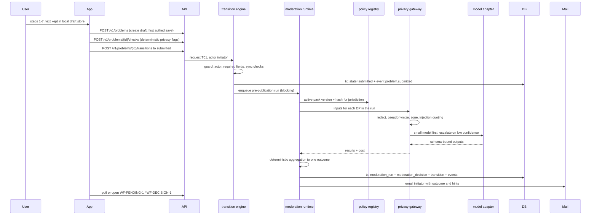
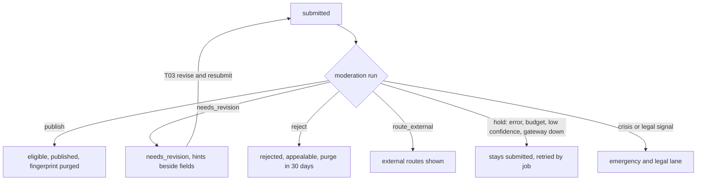

# Flow: intake and submit

## Purpose
Take a person's frustration from staged local draft to a published public problem, a needs-revision draft, a rejection, an external route, or a hold. Publication is decided by the AI moderation run under the ratified policy pack (D-51), never by a person confirming a single item.

## Trigger
The initiator presses Submit on the preview step (WF-SUBMIT-7), calling `POST /v1/problems/{id}/transitions {to: submitted}` (T01).

## Status
planned. Deterministic gate and endpoints: 03-u02 to 03-u08, app steps 03-u16 to 03-u19. Moderation run, privacy gateway, outcome applier: plan 09 (pending). Replaces 03-u09, 03-u10, 03-u24 (human queue and decision form), which plan 09 is expected to rework.

## Sequence

Labels shown to the initiator come from the brief: "Awaiting review" while the run is pending or held, "Changes requested" on `needs_revision`, and on any decision the line "Decided under policy vX" with "Policy v1, transitional stewardship" while `transitional` is true (founder-approved pack, INTERIM-1). Auditors sample these decisions later; a labeler only sees them if appealed.

Outcome mapping (transition ids from the brief): `publish` T04, `needs_revision` T02, `reject` T05, `route_external` T20 style external route shown on WF-EXTERNAL-1, `hold` stays `submitted` with an honest wait, `escalate_human` only via [emergency-legal-lane.md](emergency-legal-lane.md).

## Failure paths
- Gateway, model or budget failure: fail closed. Outcome `hold`; a retry job re-runs; nothing is published. The pending screen says the wait is longer than usual.
- Schema-invalid model output: counted as failure of that agent; retried once on the other route; else `hold`.
- Low confidence at the top of the router: `hold`, then sampled for audit (see [post-publication-recheck.md](post-publication-recheck.md)).
- Pre-publication draft purge still applies (30 days).
- Sync checks fail (identifiers, secrets): no transition, flags returned with spans; no run is started and no paid call happens.

## Data written
`problem` (state, fields), `moderation_run` (inputs hash, policy version, prompt hash, model id, outputs, cost), `moderation_decision` (rule_ids, field_ref, revision_hint, outcome, policy_version, prompt_hash, model_id, appealable_until), `draft_fingerprint`, `audit_event`. Full entity sketch: [components/server.md](../components/server.md).

## Events emitted
`problem.submitted`, `moderation.run.completed`, then one of `problem.published`, `problem.needs_revision`, `problem.rejected`, `problem.routed_external`, `moderation.held` (all planned, same transaction as the state change).

## DPs invoked
Per [../ai/decision-points.md](../ai/decision-points.md), run in this order: DP-ELIGIBILITY (public vs individual), DP-PRIVACY (personal data), DP-FRAMING (structural), DP-DUPLICATE (related), DP-NAMING (NAME-1), DP-EVIDENCE-TIER, plus DP-COMPLETENESS (every required schema field meaningfully answered) and DP-ASSUMPTIONS (incorrect factual, causal, legal or scope assumptions held back with field hints), D-58; DP-CRISIS runs first and short-circuits to the lane. Mode: blocking. The form itself is schema-driven: see [structured-submission.md](structured-submission.md).

## Related
[lifecycle-transition.md](lifecycle-transition.md), [appeal.md](appeal.md), [ux/journeys.md](../ux/journeys.md) J1, [../ai/runtime.md](../ai/runtime.md).
