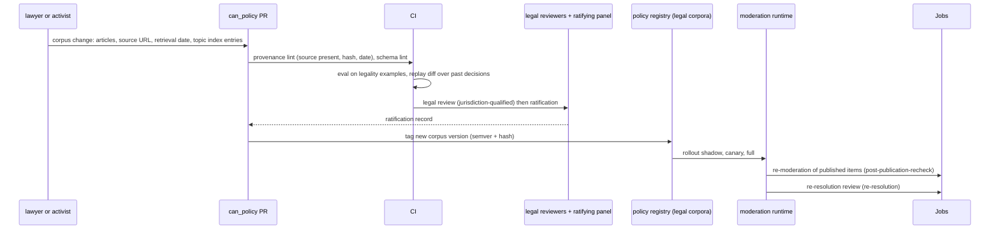

# Flow: legal corpus update

## Purpose
Keep the cumulative legal stack (D-61) correct and traceable. Lawyers, rights experts and activists (D-60) draft changes to the versioned legal corpora in `can_policy`; every article has source provenance (constitution IV.6). A new corpus version triggers re-moderation and re-resolution.

## Trigger
A new law, ruling or treaty change, or an audit or appeal finding that a corpus is wrong or incomplete. A contributor opens a PR in `can_policy` touching `packs/legal/<layer>/<jurisdiction>/`.

## Status
plan 09/10 (pending; exact ids assigned by the rework planner). Repo creation is founder-gated (D-52).

## Sequence

## Layers
L0 CAN platform rules; L1 UN human rights (UDHR, ICCPR, ICESCR); L2 supranational where binding (NL: EU Charter, EU law, ECHR); L3 national constitution; L4 national law; L5 regional law; L6 city rules. A change names its layer and jurisdiction; a change at one layer never edits another layer's corpus. Content and solutions must satisfy every layer.

## Outcomes it can cause
- A topic becomes forbidden by local law: new problems on it are not published in that jurisdiction, the refusal is logged with its legal basis, and existing items are re-moderated.
- A solution becomes illegal: affected problems go to `stuck` (legally blocked) through the normal gate, and past resolutions go through [re-resolution.md](re-resolution.md).

## Failure paths
- Missing or unverifiable source: lint fails, no review.
- Reviewer qualified in no matching jurisdiction: PR waits; transitional founder stewardship may approve only v1 (constitution VIII.2).
- Hash mismatch at server load: corpus refused, previous version stays active.
- Shadow or canary disagreement above limit: rollout halted, rollback is the previous version.

## Data written
In `can_policy`: corpus files, `ratifications/`, `CHANGELOG.md`. In `can_server`: corpus version rows (layer, jurisdiction, version, hash, state), replay report, `audit_event`.

## Events emitted
`legal.corpus.ratified`, `policy.rollout.stage_changed`, `policy.rollout.halted` (planned).

## DPs invoked
DP-LEGALITY (all layers), DP-BLOCKER, DP-DECISION-RECORD in eval and replay; DP-RERESOLUTION after activation.

## Related
[policy-amendment.md](policy-amendment.md), [post-publication-recheck.md](post-publication-recheck.md), [../components/can-policy.md](../components/can-policy.md), [../ai/legal-stack.md](../ai/legal-stack.md).
