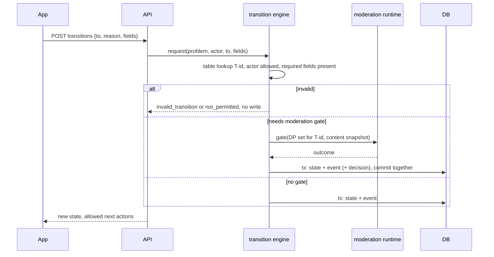

# Flow: lifecycle transition

## Purpose
Execute any transition from the brief's table with one engine: guard, state change and event written in one transaction, and a moderation gate where a DP applies.

## Trigger
`POST /v1/problems/{id}/transitions {to, reason, fields}`.

## Status
planned: 03-u01 (table as data), 03-u05 (engine, atomic event), 03-u07 (endpoint); lifecycle vocabulary 02-u09. Built today: `domain/event.ts` and the `events` table (scaffold). Moderation gate: plan 09 (pending).

## Sequence

Which transitions have a gate: T01 (intake DPs), T08 and T09 (DP-FRAMING and DP-LEGALITY on stage summaries and proposals), T11 (DP-LEGALITY dual legality gate, DP-DECISION-RECORD), T14 (DP-VERIFICATION), T15 (stuck needs a lawful route), T19 and T20 (closure and redirect reasons). The table owning these rows is the brief; this list only says where a DP applies.

## Failure paths
- Concurrent transition: row lock plus expected-state check; loser gets `conflict`.
- Event insert fails: whole transaction rolls back (unit test injects the failure).
- Gate hold: no state change, `hold` recorded, retried.
- Roles: the brief's "moderator confirms" for T04, T14, T19, T20 becomes "ratified policy decides via the run"; person-in-the-loop only for the emergency and legal lane.

## Data written
`problem.state`, `problem_event` (or `events` row in the scaffold), `moderation_run` when gated, `audit_event`.

## Events emitted
One per transition, typed from the brief (planned): `problem.<to_state>` with `from_state`, `to_state`, `reason`.

## DPs invoked
Every text-bearing gate also runs DP-COMPLETENESS and DP-ASSUMPTIONS on the structured fields (D-58). See gate list above and [../ai/decision-points.md](../ai/decision-points.md).

## Related
[`docs/spec/01-slice-1-brief.md#4-lifecycle`](../../spec/01-slice-1-brief.md#4-lifecycle), [intake-submit.md](intake-submit.md).
