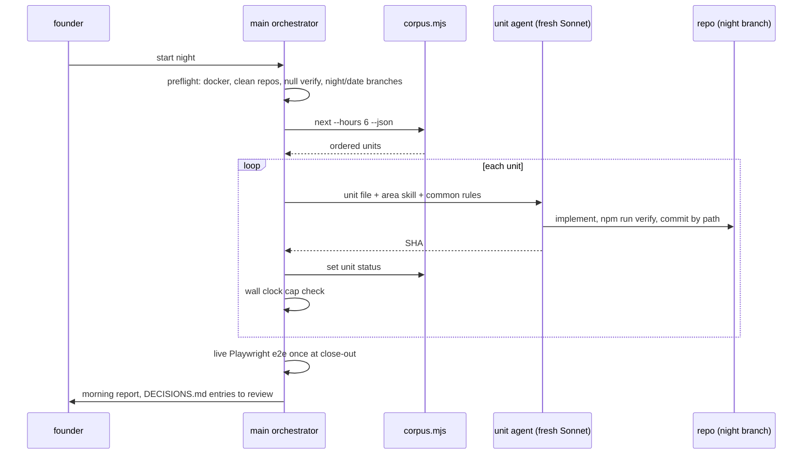

# Flow: night run

## Purpose
Build planned units unattended for about six hours with fresh Sonnet agents per unit, verified lanes, and a morning report (`/can-code-large night`, skill `.claude/skills/can-code-large/SKILL.md`).

## Trigger
Founder starts it under `caffeinate -dimsu`. Resumes from `plans/runs/<date>.md` if present.

## Status
built as a protocol (skill and `plans/tools/corpus.mjs`). Agent settings activation is planned 08-u14, report template 08-u11. Tests during a night run use FakeModel, never a paid call (D-53).

## Sequence

## Failure paths
- Docker down: units needing db or docker are skipped.
- Dirty repo: that lane aborts; never stash.
- Unit exceeds max(2 x est_hours, 1h): `TaskStop`, partial work committed to `wip/<date>-<unit>`, unit `blocked` with `timeout`.
- Red lane: only a fix unit or skip.
- Founder-gated units (real SMTP, device tests, live AI key, `can_policy` repo creation) are never selected.

## Data written
Commits on `night/<date>` branches, `plans/runs/<date>.md`, unit statuses in the corpus.

## Events emitted
None (not a product flow).

## DPs invoked
None. AI units are tested through FakeModel and recorded responses.

## Related
[plans/FORMAT.md](../../../plans/FORMAT.md), [background-jobs.md](background-jobs.md).
