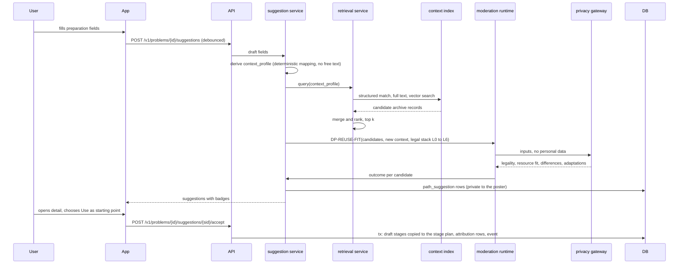

# Flow: path suggestion

## Purpose
While a poster prepares a problem, find archived problems with a similar context and show adapted paths that worked (or failed) elsewhere (D-76). Suggestions speed things up. They are never adopted automatically, never replace volunteer review (REVIEW-1) and always credit their sources.

## Trigger
The poster changes a context field in WF-PREP-1 (problem type, place, scale, resources, institutions, constraints), after a short pause. Also when the poster opens an archived case and chooses "Use this as a starting point".

## Status
planned, W12 (D-76).

## Sequence

## Steps
1. **Profile.** The `context_profile` is built from structured fields only. Free text is not sent to retrieval unless it passes the privacy gateway; the vector uses the profile summary, so retrieval works across languages in a shared embedding space.
2. **Retrieve.** Hybrid: structured `context_profile` matching, Postgres full text, pgvector similarity; merged and ranked. Only public `archive_record` rows are searched.
3. **Check fit.** DP-REUSE-FIT scores similarity per dimension, flags differences, proposes adaptations, and checks legality under the new legal stack (L0 to L6) and resource and budget fit. A path that is not allowed stays listed with the reason and has no use action.
4. **Show.** Cards in WF-SUGGEST-1, detail in WF-SUGGEST-2. Results are cached by (profile hash, corpus version, policy version).
5. **Accept.** Only an explicit confirm copies the draft stages into the poster's stage plan as editable stages. `attribution` rows link the stages to the source archive records (REUSE-CREDIT-1). Facts and criteria are never changed. Accepting is optional and reversible until publication.
6. **Review is unchanged.** The problem still needs at least one completed volunteer review. Strong archive evidence is shown to reviewers as context, which can make review faster, never skipped (REUSE-NOBLOCK-1).

## Failure paths
- Provider, index or gateway down: the panel says suggestions are unavailable, the form keeps working, and sending for review is not blocked.
- No candidates or too few fields: empty and prompt states.
- Archive record later retracted or re-archived under newer rules: the suggestion shows the record's version note.
- Rate limit per poster and a spend cap per day; cached results are served first.

## Data written
`path_suggestion`, `attribution` (on accept), `stage` and `stage_edge` (on accept), `moderation_run`, `audit_event`.

## Events emitted
`suggestion.shown`, `suggestion.accepted`, `suggestion.dismissed` (planned; no personal data).

## DPs invoked
DP-REUSE-FIT. See [../ai/archive-reuse.md](../ai/archive-reuse.md).

## Related
[problem-preparation.md](problem-preparation.md), [archive-on-terminal.md](archive-on-terminal.md), [stage-draft.md](stage-draft.md), [../components/server.md](../components/server.md).
