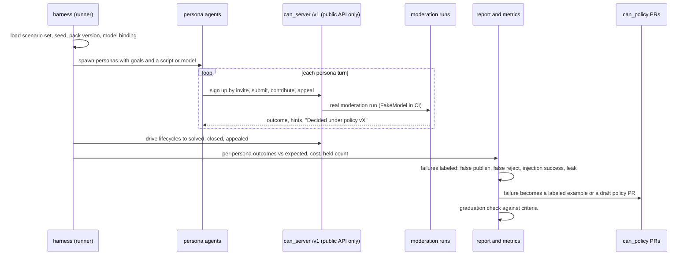

# Flow: persona simulation run

## Purpose
Prove the pipeline before real people join (D-55). A harness runs AI persona agents (submitters, contributors, proposers, appellants, adversarial actors) against the real server through its public API. Failures red-team the policy pack and feed the amendment loop. Graduation criteria decide when public participation opens.

## Trigger
CI and night runs (deterministic: FakeModel, scripted personas), recorded replay, or a live run (OpenRouter, free or cheap models, synthetic data only, budget-capped; D-65). Detail: [../ai/simulation.md](../ai/simulation.md).

## Status
plan 11 (pending). Live persona runs need the key and an explicit run budget under the spend cap (D-65); the graduation review stays founder-gated.

## Sequence

Screen: WF-SIM-1 (run report for maintainers).

## Failure paths
- A persona bypassing the API (direct DB access) is a harness bug: the runner has only HTTP credentials.
- Live run over spend cap: stops, partial report marked incomplete.
- Nondeterminism: CI personas are scripts with a fixed seed and turn order; live runs record transcripts, so a finding can be replayed in recorded-replay mode.
- Simulation data never mixes with real data: a separate database and a `simulation` policy label on every account; reports contain no real content.

## Data written
Report (JSON plus summary), metrics, transcripts, proposed labeled examples. Nothing in production tables.

## Events emitted
None in production. Test-database events are the normal ones.

## DPs invoked
All, because the scenarios cover every content type. Adversarial personas aim at DP-PRIVACY, DP-NAMING, DP-CRISIS, DP-ASSUMPTIONS and injection defenses.

## Graduation check
SIM-GATE-1: public participation opens only when criteria G1 to G13 of [../ai/simulation.md](../ai/simulation.md) section 8 hold (seeds reach verified terminal states, 0 privacy leaks and 0 injection successes in the stated run counts, recall and false-reject bounds, appeal loop exercised, fail-closed matrix, rollback, parity, cost, founder ratification record). Values live in `can_policy/simulation/thresholds.yaml`. Deterministic CI runs can only meet G1 (machinery), G9, G10 and regression; the rest need founder-gated live runs. Any critical miss resets the counters. Output: a graduation report the founder reads.

## Related
[policy-amendment.md](policy-amendment.md), [appeal.md](appeal.md), [seed-bootstrap.md](seed-bootstrap.md), [../ai/evaluation.md](../ai/evaluation.md).
