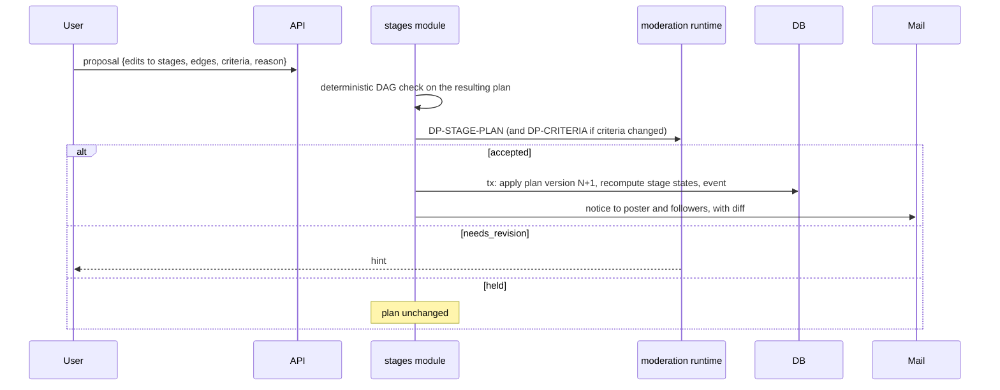

# Flow: stage plan change

## Purpose
Change the stage plan of a published problem: add, remove, reorder or re-criteria stages. Never silent (PLAN-CHANGE-1).

## Trigger
A member or the poster files a proposal at `POST /v1/problems/{id}/plan-changes`, from WF-STAGEMAP-1.

## Status
planned, W10 (D-72: the plan can change after publication through a proposal checked by the AI).

## Sequence

Rules:
- Poster approval: a proposal by someone else needs the poster's acceptance with a reason (like RECO-1); the poster's own proposals skip this step.
- Resolved stages are never deleted or re-criteria'd; to redo one, propose reactivation, which behaves like a reopen of that stage and returns its pending successors to `planned`.
- Removing a stage with work uses `skipped` with a reason; contributions stay visible.
- The old plan version stays in history; the public stage map shows "Plan changed on {date}".

## Failure paths
- Cycle or dangling edge: rejected before any run.
- Concurrent plan changes: optimistic `plan_version` check, loser gets `conflict`.
- Model failure: `hold`, plan unchanged.

## Data written
`stage`, `stage_edge`, `acceptance_criterion`, plan version row, `moderation_run`, `notice`.

## Events emitted
`plan.change_proposed`, `plan.change_applied`, `plan.change_declined` (planned).

## DPs invoked
DP-STAGE-PLAN, DP-CRITERIA, DP-LEGALITY, DP-PRIVACY.

## Related
[stage-advancement.md](stage-advancement.md), [problem-preparation.md](problem-preparation.md).
