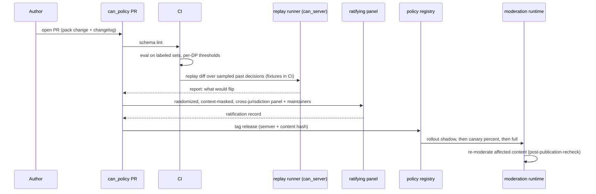
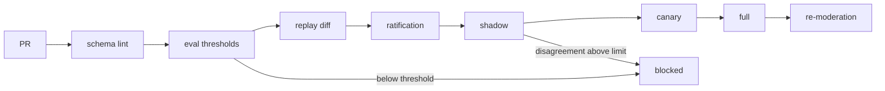

# Flow: policy amendment

## Purpose
Change moderation by changing policy: a PR to `can_policy` goes through eval, replay diff, ratification, staged rollout and re-moderation. The community acts after the fact on outcomes, and before the fact on rules.

## Trigger
A PR to `can_policy` (prompt, rule, example, threshold, jurisdiction overlay), often prompted by an appeal label, an audit finding or a law change.

## Status
plan 09 (pending). Repo creation is a founder-gated plan unit (D-52); until then packs are fixtures inside `can_server`.

## Sequence

## Failure paths
- Eval below threshold or lint failure: PR blocked.
- Shadow or canary shows excess disagreement: rollout halted, previous version stays active; rollback is selecting the prior version.
- Hash mismatch when the server loads a pack: pack refused, previous active version kept.
- Transitional: founder stewardship approves v1 (constitution VIII.2); recorded in `ratifications/`.

## Data written
In `can_policy`: pack, `ratifications/`, `CHANGELOG.md`. In `can_server`: `policy_pack_version` (version, hash, state), rollout row, replay report, `audit_event`.

## Events emitted
`policy.version.ratified`, `policy.rollout.stage_changed`, `policy.rollout.halted` (planned).

## DPs invoked
Every DP touched by the change runs in eval and replay. See [../ai/amendment-loop.md](../ai/amendment-loop.md), [../ai/policy-pack.md](../ai/policy-pack.md), [../ai/evaluation.md](../ai/evaluation.md).

## Related
[../components/can-policy.md](../components/can-policy.md), [post-publication-recheck.md](post-publication-recheck.md).
