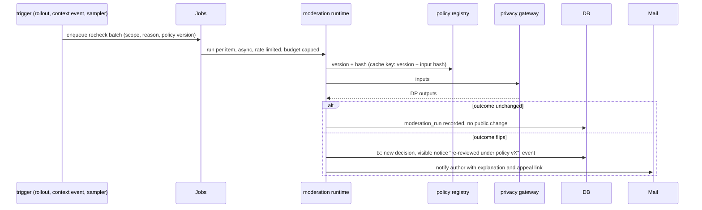

# Flow: post-publication re-check

## Purpose
Published content is re-moderated asynchronously when the policy changes, when its context changes, or when it is sampled for audit. Nothing is removed silently: a flipped item gets a visible notice, an explanation and an appeal path.

## Trigger
1. Policy rollout reaches full (see [policy-amendment.md](policy-amendment.md)).
2. Context change: a new related problem, a legal-corpus update at any layer L0 to L6 ([legal-corpus-update.md](legal-corpus-update.md)), a new contribution that alters an item's evidence tier.
3. Periodic sampling job (auditors review the sample).

## Status
plan 09 (pending). Needs the job runner ([background-jobs.md](background-jobs.md)).

## Sequence

## Failure paths
- Run fails: item keeps its current public state; batch retries with backoff; spend cap pauses the batch and emits an alert, never fails open or closed on content.
- Flip to `reject` on published content: the item is hidden only with the notice, rule citation and appeal; the previous text remains in history.
- Replay of a very large scope: batches are chunked and resumable by cursor.

## Data written
`moderation_run` (trigger, scope), `moderation_decision`, notice row, `audit_event`.

## Events emitted
`moderation.recheck.started`, `moderation.recheck.flipped`, `content.rereviewed` (planned).

Screen: WF-REMOD-1. Auditors use WF-AUDIT-1 and WF-AUDIT-2.

Every legality re-check applies the full legal layer stack L0 to L6 for the item's jurisdiction (D-61). A policy or corpus change also starts [re-resolution.md](re-resolution.md) for solved, closed, redirected and stuck problems.

## Notices
A flipped item shows "re-reviewed under policy vX" (notices read model, plan 09 pending) with explanation and appeal path; unchanged items show "Decided under policy vX". Auditors sample unflipped items. A schema version bump (see [policy-schema-change.md](policy-schema-change.md)) is not a re-review trigger by itself: published content keeps its schema version.

## DPs invoked
All DPs applicable to the item type, with the new policy version. Mode: async. See [../ai/triggers.md](../ai/triggers.md) and [../ai/decision-points.md](../ai/decision-points.md).

## Related
[appeal.md](appeal.md), [../ai/amendment-loop.md](../ai/amendment-loop.md).
