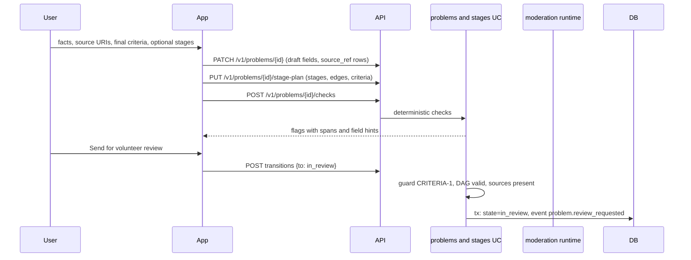

# Flow: problem preparation

## Purpose
Let the poster prepare the structured problem privately (D-72 step 1): facts, trusted sources, final acceptance criteria and an optional stage plan, so that volunteers and the AI judge a complete submission. Nothing here is public.

## Trigger
Poster opens or edits a `draft` problem (WF-PREP-1 to WF-PREP-3), then presses "Send for volunteer review".

## Status
planned, W10 (D-72). Replaces the single submit step of the old fixed flow; the schema-driven form itself is [structured-submission.md](structured-submission.md).

## Sequence

Stage plan is optional. A poster may pick the `classic-5` template, build a custom DAG, or send no stages (one implicit stage whose criteria are the final criteria).

## Deterministic checks (no model call)
- Final acceptance criteria present (CRITERIA-1), each with a measure text.
- Stage graph: no cycles, no dangling edge, at least one start node, every stage has criteria, every required stage reaches the end.
- At least one `source_ref` per factual claim group, valid https URI; reachability is checked later by DP-SOURCE-TRUST.
- Privacy flags (identifiers, secrets) as in [intake-submit.md](intake-submit.md); flags block the transition and no paid call happens.

## Failure paths
- Check fails: no transition, flags returned beside the fields.
- Edits while `in_review` are not allowed; the poster resolves recommendations instead ([volunteer-review.md](volunteer-review.md)).
- Draft purge: 30 days after the last change, as for drafts today.

## Data written
`problem` (draft fields), `source_ref`, `acceptance_criterion`, `stage`, `stage_edge`, `problem_event`.

## Events emitted
`problem.draft_saved`, `problem.review_requested` (planned).

## DPs invoked
None on save. DP-COMPLETENESS may run as an optional fill-assist hint. The full DP set runs at publication ([publication-decision.md](publication-decision.md)).

## Related
[volunteer-review.md](volunteer-review.md), [plan-change.md](plan-change.md), [../components/server.md](../components/server.md).
