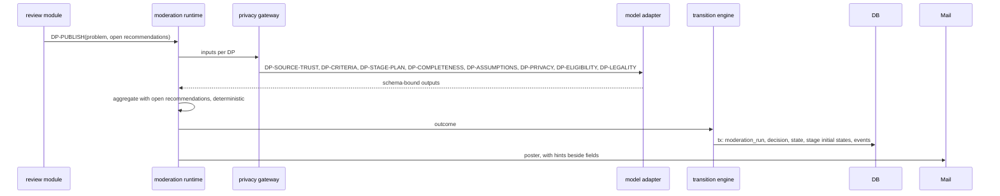

# Flow: publication decision

## Purpose
Decide, by AI under the ratified policy pack (D-51, D-72 step 3), whether a reviewed problem is published, needs revision, is rejected, or is held. The poster never confirms a single item; a person acts only through the emergency and legal lane.

## Trigger
Quorum met in [volunteer-review.md](volunteer-review.md), or the poster resubmits from `needs_revision`.

## Status
planned, W10. Supersedes the single-run submit decision in [intake-submit.md](intake-submit.md) (its run machinery is reused).

## Sequence

Outcome mapping:

| Outcome | State | Notes |
|---|---|---|
| publish | `active` | Stages with no predecessors become `ready`; the rest are `planned`. Fingerprint purged. |
| needs_revision | `needs_revision` | Hints beside fields (sources, criteria, stages). Poster edits, then resubmits to review or straight to DP-PUBLISH if no stage or criteria field changed. |
| reject | `rejected` | Appealable ([appeal.md](appeal.md)). |
| hold | `held` | Any run failure, budget, low confidence, or gateway down. Retried by job; nothing published. |

Aggregation rules (deterministic): any DP-PRIVACY, DP-LEGALITY or DP-ELIGIBILITY failure blocks publish; DP-SOURCE-TRUST, DP-CRITERIA, DP-STAGE-PLAN or DP-COMPLETENESS failing gives `needs_revision`; unresolved high-impact open recommendations lower confidence and push to `needs_revision`; unresolved low-impact ones are noted. DP-CRISIS runs first and short-circuits to [emergency-legal-lane.md](emergency-legal-lane.md).

## Suggestions and stage draft (D-76)
Accepted suggestions and their attribution are inputs to DP-STAGE-PLAN and are shown to volunteer reviewers as context. They never replace the review (REVIEW-1, REUSE-NOBLOCK-1). On `active`, the suggestion service starts DP-STAGE-DRAFT ([stage-draft.md](stage-draft.md)) and the poster is offered the draft in WF-STAGEDRAFT-1. When the problem later ends it is archived ([archive-on-terminal.md](archive-on-terminal.md)).

## Failure paths
- Schema-invalid output: retried once on the other route, else `held`.
- Source URI unreachable: DP-SOURCE-TRUST reports `unverifiable`, not `fail`; hint asks for another source.
- Pack changes mid-run: the run keeps its pinned version.

## Data written
`moderation_run`, `moderation_decision`, `stage` initial states, `problem_event`, `audit_event`.

## Events emitted
`moderation.run.completed`, then `problem.published`, `problem.needs_revision`, `problem.rejected` or `moderation.held` (planned).

## DPs invoked
DP-PUBLISH aggregating DP-SOURCE-TRUST, DP-CRITERIA, DP-STAGE-PLAN, DP-COMPLETENESS, DP-ASSUMPTIONS, DP-PRIVACY, DP-ELIGIBILITY, DP-LEGALITY, plus open recommendations. See [../ai/decision-points.md](../ai/decision-points.md).

## Related
[stage-advancement.md](stage-advancement.md), [intake-submit.md](intake-submit.md), [lifecycle-transition.md](lifecycle-transition.md).
