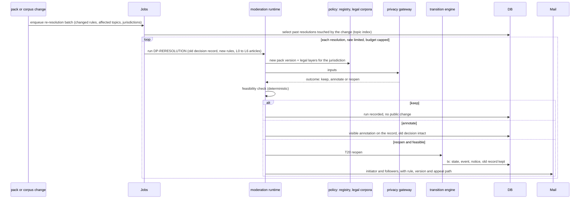
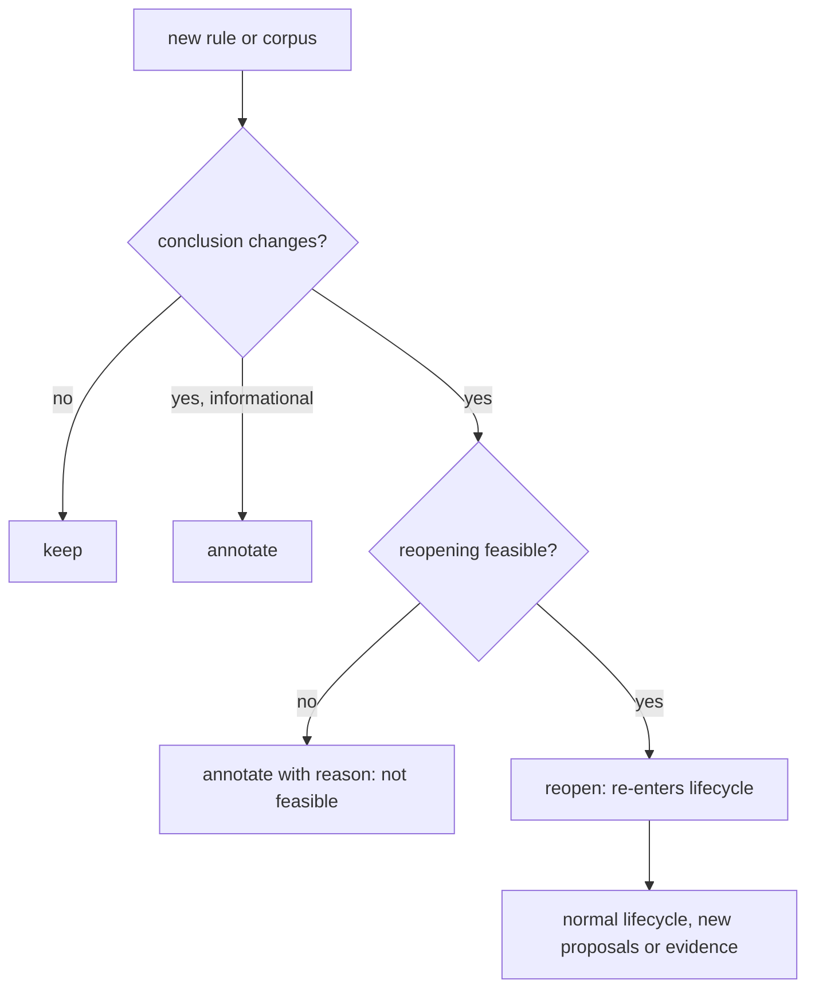

# Flow: re-resolution

> **D-72 (W10):** a reopen (T20, T21) returns the problem to `active` and reactivates only the affected stages (resolved back to `active`; their unstarted successors back to `planned`). The "earliest state" default below reads as "the earliest affected stage". Stage resolutions and `stage_choice` records are re-resolved like decision records and never deleted.

## Purpose
When the rules change, past resolutions may no longer hold (D-59). A review job replays the new rule over solved, closed, redirected and stuck problems and their decision records. If the conclusion changes and reopening is feasible, the problem reopens for re-resolution. It is never silent, never deletes the old record, and can be appealed.

## Trigger
A policy version reaching full rollout ([policy-amendment.md](policy-amendment.md)), or a legal-corpus version activating ([legal-corpus-update.md](legal-corpus-update.md)).

## Status
plan 09/10 (pending; the rework planner assigns exact ids). Uses transitions T20 and T21 and rule RERESOLVE-1 in [../../spec/01a-lifecycle.md](../../spec/01a-lifecycle.md) (the table is not restated here). Feasibility criteria are open question `OQ-reresolution-feasibility`; the defaults below are D-59's.

## Sequence

Feasibility defaults: the problem still exists, the jurisdiction is still enabled, the original initiator or a steward can be notified, and reopening does not undo a lawful completed implementation without a new proposal. When infeasible the item is annotated with the reason, not reopened.

## Failure paths
- Model or budget failure: that item is retried; nothing changes meanwhile. A run never reopens on low confidence: it annotates for audit.
- Initiator unreachable: a steward is notified; if none, annotate only.
- Reopened problem later resolved again: a new archive record; the earlier one stays in history.
- Appeal: the initiator or any follower can appeal the re-resolution decision ([appeal.md](appeal.md)); an independent re-run, then a label task if disputed.
- Emergency or legal signal during review: [emergency-legal-lane.md](emergency-legal-lane.md).

## Data written
`moderation_run` (trigger `re_resolution`, with policy and corpus versions), `moderation_decision`, annotation rows, transition event, notices, `audit_event`. Old decision records are never edited or deleted.

## Events emitted
`resolution.review.completed`, `resolution.annotated`, `problem.reopened` (planned), `notice.created`.

## DPs invoked
DP-RERESOLUTION (see [../ai/decision-points.md](../ai/decision-points.md)), DP-LEGALITY over all legal layers L0 to L6, DP-CRISIS on any text. Mode: async, bounded. Reopening goes to the earliest state the changed conclusion affects (default `solution_development`, `eligible` if eligibility or legality of the problem itself changed).

## Related
[post-publication-recheck.md](post-publication-recheck.md), [lifecycle-transition.md](lifecycle-transition.md), [../ai/legal-stack.md](../ai/legal-stack.md).
