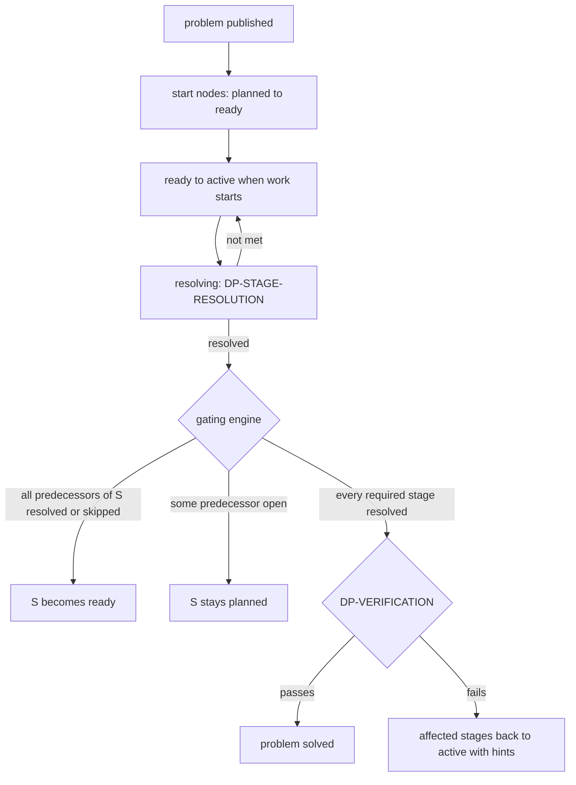

# Flow: stage advancement

## Purpose
Run the per-problem stage plan as a DAG (D-72 step 4 and 5): a stage becomes ready only when all predecessors are resolved, branches run in parallel, and the problem is solved when all required stages are resolved and DP-VERIFICATION passes.

## Trigger
A stage changes state: published problem, stage `resolved`, `skipped`, or a plan change applied.

## Status
planned, W10. Engine lives in the `stages` module ([../components/server.md](../components/server.md)).

## Sequence

Gating engine, run in the same transaction as the stage change:
1. Recompute for every `planned` successor of the changed stage: ready iff all `depends_on` predecessors are `resolved` or `skipped` (STAGE-GATE-1).
2. A stage can be started only from `ready`. A person trying to start a `planned` stage gets `not_ready`; contributions to it are still accepted and kept (STAGE-PREP-1, [contribution-and-proposal.md](contribution-and-proposal.md)).
3. Parallel branches are independent; one `blocked` branch does not block the others, but does block the stages after it.
4. A `skipped` stage counts as resolved for gating, only through an accepted [plan-change.md](plan-change.md).
5. When all required stages are resolved, request DP-VERIFICATION against the final criteria; `solved` on pass, with a archive record.

Problem-level labels: "Active: stage {name}", or "Active: {n} stages in progress".

## Failure paths
- Concurrent resolutions of two predecessors: row lock on the successor stage; the engine recomputes under lock, so a successor becomes ready exactly once.
- DP-VERIFICATION hold: problem stays `active`, retried.
- Problem leaves `active` (paused, stuck, closed): stage states are kept; `paused` freezes starts, no stage resolves.

## Data written
`stage.state`, `problem.state`, `problem_event`, archive record, `moderation_run`.

## Events emitted
`stage.ready`, `stage.active`, `stage.resolved`, `stage.blocked`, `stage.skipped`, `problem.solved` (planned).

## DPs invoked
DP-VERIFICATION, DP-STAGE-RESOLUTION (via [stage-work.md](stage-work.md)), DP-BLOCKER for `blocked`.

## Related
[stage-work.md](stage-work.md), [lifecycle-transition.md](lifecycle-transition.md), [task-and-verification.md](task-and-verification.md).
