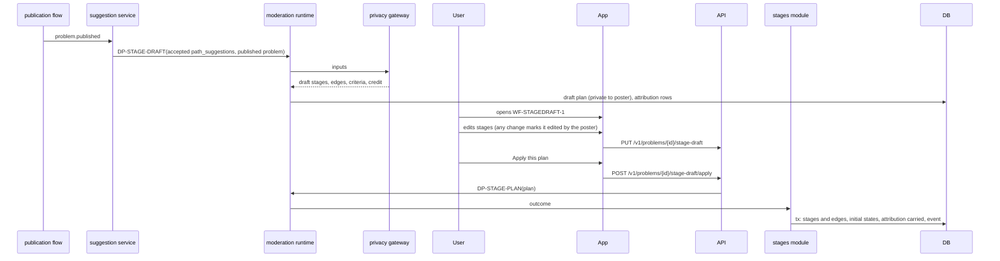

# Flow: AI-drafted stage plan

## Purpose
After publication, give the poster a draft stage plan built from the suggestions they accepted (or from the best matching paths), so work can start straight away (D-76). The poster edits it, then it goes through the normal plan check. Credit is kept.

## Trigger
A problem becomes `active` (D-72 step 3) and the poster has accepted at least one suggestion, or matching paths exist and no stage plan was set.

## Status
planned, W12 (D-76). Uses the machinery of [plan-change.md](plan-change.md) and [stage-advancement.md](stage-advancement.md).

## Sequence

## Steps
1. DP-STAGE-DRAFT drafts stages, `depends_on` edges and per-stage criteria from the accepted suggestions, adapted to the published problem. Without accepted suggestions it uses the top matches and says so.
2. The draft is private to the poster. Nothing starts and no stage becomes `ready` until it is applied.
3. The poster edits with the same editor as WF-PREP-3. Each stage keeps its source and shows "Edited by you" after a change.
4. Apply runs DP-STAGE-PLAN (DAG valid, criteria on every stage). On pass, stages with no predecessors become `ready`, the rest `planned`, and `attribution` is carried onto each stage taken from a source case (REUSE-CREDIT-1). On failure, the reason is shown and the draft is kept.
5. Community input stays open: others can add options and contributions to planned stages ahead of time (STAGE-PREP-1). They are not a blocker (REUSE-NOBLOCK-1).
6. After apply, any further change is a plan-change proposal ([plan-change.md](plan-change.md), PLAN-CHANGE-1).

## Failure paths
- DP-STAGE-DRAFT fails or the gateway is down: "We could not draft a plan now"; the poster builds one by hand. The problem is already published and is not affected.
- Apply while a plan already exists (set meanwhile): the apply is refused with a prompt to use a plan-change proposal.
- Poster inactive: the draft is kept for 30 days, then dropped; no stage starts by itself.

## Data written
`stage_draft` (private), `stage`, `stage_edge`, `acceptance_criterion`, `attribution`, `moderation_run`, `problem_event`.

## Events emitted
`stagedraft.created`, `stagedraft.applied`, `stagedraft.discarded` (planned).

## DPs invoked
DP-STAGE-DRAFT, then DP-STAGE-PLAN. See [../ai/archive-reuse.md](../ai/archive-reuse.md) and [../ai/decision-points.md](../ai/decision-points.md).

## Related
[path-suggestion.md](path-suggestion.md), [publication-decision.md](publication-decision.md), [stage-advancement.md](stage-advancement.md).
