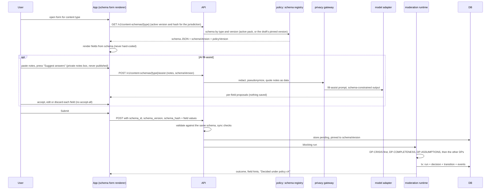

# Flow: structured submission

## Purpose
No content type allows free-form posting (D-58). Every type (problem, contribution, proposal, decision record, task update, verification evidence) is a form rendered from a content schema that the community decided in advance and stored in the `can_policy` pack. This flow shows how a form is built, optionally pre-filled by AI, and checked.

## Trigger
The user opens any submit or edit screen (for example WF-SUBMIT-1) and later presses Submit.

## Status
plan 10 (pending): schema registry, form renderer, fill-assist. Moderation run underneath is plan 09 (pending). Replaces the hard-coded fields of 03-u16 to 03-u19. Detail: [../ai/structured-content.md](../ai/structured-content.md) (SCHEMA-1, AI-ASSIST-1).

## Sequence

## Failure paths
- Schema version unknown or retired: rejected as unknown or retired with a prompt to reload; the draft keeps its pinned version or the app offers a migration (see [policy-schema-change.md](policy-schema-change.md)).
- Fill-assist unavailable, over budget or gateway down: the form works without it; no error blocks submitting.
- Suggestions are never submitted unconfirmed: the server accepts only values the client sends, and marks accepted fields `assisted: true` with `assist_run_id`, shown to auditors and in the decision explanation as "suggested by AI, confirmed by the poster".
- DP-COMPLETENESS fails (required field blank, filler, off-topic): `needs_revision` with a hint beside that field.
- DP-ASSUMPTIONS finds an incorrect factual, causal, legal or scope assumption: `needs_revision` with a hint beside the field and the assumption named; nothing publishes.
- Model failure: `hold` ("Awaiting review"), retried; fail closed.

## Data written
Content row with `schema_version` and field values, `assisted` flags with `assist_run_id`, `moderation_run`, `moderation_decision`, `audit_event`.

## Events emitted
`content.submitted`, `moderation.run.completed`, then the outcome events of [intake-submit.md](intake-submit.md) (planned).

## DPs invoked
DP-CRISIS, DP-COMPLETENESS, DP-ASSUMPTIONS, DP-PRIVACY, DP-NAMING, DP-TONE, plus the type-specific ones (DP-ELIGIBILITY, DP-FRAMING, DP-DUPLICATE, DP-CONTRIB-RELEVANCE, DP-LEGALITY, DP-DECISION-RECORD, DP-VERIFICATION, DP-EVIDENCE-TIER). Blocking. See [../ai/decision-points.md](../ai/decision-points.md).

## Related
[intake-submit.md](intake-submit.md), [content-update.md](content-update.md), [policy-schema-change.md](policy-schema-change.md), [../components/app.md](../components/app.md).
