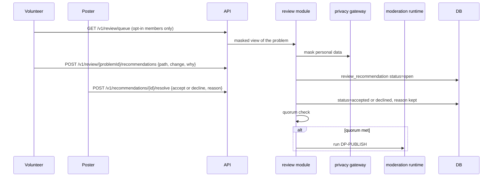

# Flow: volunteer review

## Purpose
Opted-in volunteers check a private problem and recommend changes to data and metadata (facts, sources, stages, stage criteria, final criteria). The poster accepts or declines each recommendation with a reason. When the quorum is met, the publication decision runs (D-72 step 2 and 3, REVIEW-1, RECO-1).

## Trigger
Problem enters `in_review`. A volunteer opens WF-VREVIEW-1 (queue) and WF-VREVIEW-2 (review).

## Status
planned, W10. Volunteers are signed-in members who opt in; the opt-in is a flag on the account, revocable.

## Sequence

Rules applied:
- REVIEW-1: review content is never public and personal data is masked; the poster's own account never reviews its problem.
- RECO-1: a recommendation stays `open` until the poster accepts or declines with a reason. Accepting edits the draft at the cited path (or the poster edits and links the change); declining keeps the reason.
- Quorum, default for `OQ-review-quorum`: 3 distinct volunteers have finished a review (a review is at least one recommendation or an explicit "no changes"), and no recommendation has been open for more than 7 days. After 14 days with at least 1 finished review the poster may send to DP-PUBLISH anyway; open recommendations are then weighed there.
- Volunteers cannot publish, reject or edit. Spam recommendations are limited per day and judged by DP-TONE and DP-PRIVACY.

## Failure paths
- No volunteer reviews: the problem waits in `in_review`; the poster sees the day count and the 14 day option.
- Recommendation leaks personal data: masked before storing; DP-PRIVACY failure holds the item.
- Volunteer opts out mid-review: finished reviews stay counted, open drafts are dropped.

## Data written
`review_recommendation` (path, proposed change, status, reason, reviewer, timestamps), `audit_event`, account opt-in flag.

## Events emitted
`review.recommendation_added`, `review.recommendation_resolved`, `review.quorum_met` (planned).

## DPs invoked
DP-PRIVACY and DP-TONE on recommendations; DP-PUBLISH after quorum.

## Related
[problem-preparation.md](problem-preparation.md), [publication-decision.md](publication-decision.md), [ux wireframes WF-VREVIEW-1 to 3](../ux/wireframes/).
