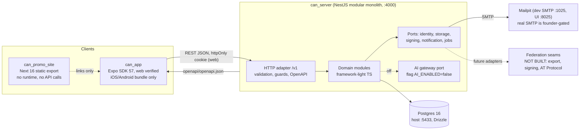
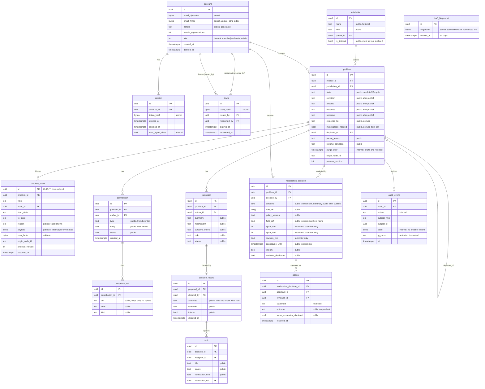

# CAN slice 1 system design

Status: design baseline for plan units. Binding inputs: `DECISIONS.md` (D-1 to D-28), `docs/spec/01-slice-1-brief.md` (scope, defaults, lifecycle table). Tonight `can_server` and `can_app` are scaffolds (D-25); this document specifies the slice so later plan units can build it without inventing architecture. Where this file and the brief disagree about lifecycle, the brief wins.

Lifecycle states, transitions, actors, labels and next actions live only in [`docs/spec/01-slice-1-brief.md#lifecycle`](../spec/01-slice-1-brief.md#lifecycle). This file never restates them.

## 1. Containers

Ports: API :4000, Expo web :8081, promo :3000, Postgres :5433 (D-4, default 13).

Rules that follow from the diagram:
- The promo site never calls the API. It is static HTML and links to the repository, docs and open questions.
- The app talks only to `/v1`. Its client is generated from `can_server/openapi/openapi.json` (ADR 0002).
- The AI gateway is an interface with a `NoopAiGateway` bound when `AI_ENABLED=false`. Nothing in slice 1 sets it true (ADR 0006).
- No object storage, Redis or queue in slice 1. Jobs run as Nest scheduled tasks calling job port methods, backed by Postgres rows (`SELECT ... FOR UPDATE SKIP LOCKED`).

## 2. can_server module boundaries

Layout inside `can_server/src`: each module has `domain/` (pure TS, no Nest or Drizzle imports), `app/` (use cases taking ports), `infra/` (Drizzle repos, adapters), `http/` (controllers, DTO schemas). A lint rule forbids `domain/` importing `@nestjs/*`, `drizzle-orm` or `infra/`.

| Module | Owns | Depends on | Notes |
|---|---|---|---|
| `accounts` | account, session, invite, handle generation, email encryption, sign-in codes | audit, notification port | Only module that sees plaintext email, and only at send time. |
| `problems` | problem, problem_event, lifecycle transition engine, jurisdiction, draft_fingerprint, deterministic submission checks | accounts, moderation, audit | The transition engine executes the brief's table as data. Invalid transitions fail atomically. |
| `moderation` | moderation_decision, appeal, review queue, interim flag, reviewer-selection rule | problems, accounts, audit | Emits decisions with `rule_ids[]`, span ref, `revision_hint`, `appealable_until`. |
| `contributions` | contribution, evidence_ref (URL only) | problems, moderation | Typed contributions; the type list comes from the brief. |
| `proposals` | proposal | problems, contributions | Comparison data only; no voting rule (decision rule is a recorded text, not a score). |
| `decisions` | decision_record | proposals, problems | States who decided, under which authority, why. |
| `tasks` | task | decisions, problems | Task status, verification evidence refs. |
| `audit` | audit_event | none | Write-only API for other modules; read for moderators. |
| `platform` (not domain) | config, health, event log writer, clock, id generator (UUIDv7), retention jobs | none | Shared kernel; keep tiny. |

Dependency direction is one way (arrows above go from left column to "Depends on"). `audit` and `platform` depend on nothing. Cross-module calls go through exported use-case interfaces, never through another module's tables.

Domain rules unit-tested without Nest: transition guard (actor, required fields), eligibility and privacy checks, reviewer selection, retention date computation, handle generation, fingerprinting.

## 3. Slice 1 ERD

Conventions: ids are UUIDv7 (`uuid` column, generated in the app by `platform.IdGenerator`). Every public-capable row carries `origin_node_id` (text, default the single node id) and `protocol_version` (int). Timestamps are `timestamptz`. Sensitivity: public / internal / restricted / secret. Retention is stated per entity in the table after the diagram.

`draft_fingerprint` has no foreign key on purpose: it must not link back to an account or problem once the draft is purged. It therefore has no relationship line in the diagram. Sign-in codes live in `login_code` (account_id, code_hash secret, expires_at 10 min, attempts, consumed_at), an auxiliary table owned by `accounts`.

### Retention and deletion

| Entity | Retention |
|---|---|
| draft or rejected or withdrawn problem body | Hard-deleted 30 days after the state change (`purge_after`); UI shows the date. Event rows keep only type, states and timestamps, no body text. |
| draft_fingerprint | Deleted 90 days after creation. Salt rotated yearly; old fingerprints expire, never re-hashed. |
| published problem, contribution, proposal, decision_record, task, problem_event | Kept; public record. Withdrawn contributions become tombstones (see UX). |
| moderation_decision, appeal | Kept with the problem; `revision_hint` and spans cleared at purge for rejected drafts. |
| session | Deleted 30 days after expiry or revoke. |
| login_code | Deleted 24 hours after expiry or consumption. |
| invite | Kept 1 year after redeem (abuse tracing); `code_hash` only. |
| audit_event | 2 years; no secrets inside. |
| account | Delete request: email fields erased immediately, handle kept as `deleted-member`, public contributions stay under that handle. |

### Sensitivity rules enforced in code

- `secret`: never leaves the server, never logged, never in OpenAPI responses (email, hashes, ciphertext).
- `restricted`: returned only to the owner or a moderator, role checked in the use case.
- `internal`: moderators and admins only.
- `public`: only after the problem is published. Before publish, the initiator and moderators see drafts; everyone else gets a tombstone, never 404 for withdrawn published items.
- Email: AES-256-GCM with a key from `EMAIL_ENC_KEY` env (never committed); lookup via HMAC-SHA256 blind index with `EMAIL_INDEX_KEY`.

## 4. Event log

`problem_event` is the append-only history for lifecycle and consequential changes; `audit_event` records operational and security actions (sign-in, role changes, moderator reads). Both are insert-only: the app DB role has no UPDATE or DELETE on them (migration grants), and a test asserts that.

- Id: UUIDv7. `origin_node_id` and `protocol_version` on every row. `prev_hash` nullable bytea, always null in slice 1 (reserved for the later chain; no hashing code now).
- Same-transaction write: the state change and its `problem_event` row commit together or not at all. The transition engine takes a Drizzle transaction and writes both; a unit test injects a failing insert and asserts the state did not change.
- Ordering: consumers order by UUIDv7 id; no separate sequence column.
- No payloads containing email, tokens or restricted text. Purge of draft bodies leaves events intact.

## 5. Auth flow

1. Redeem: `POST /v1/auth/signup {inviteCode, email}`. Server validates the unused invite, creates the account (email encrypted, blind index computed, handle generated), marks the invite redeemed, sends a 6-digit code. The response returns `{handle}` and never echoes the email.
2. Verify: `POST /v1/auth/verify {email, code}` (also the sign-in path for existing accounts, started by `POST /v1/auth/code {email}`). Codes: 6 digits, 10 minutes, 5 attempts then invalidated, hashed at rest, constant-time compare, rate limited per email and per IP. The response never reveals whether an email exists (always "If that address can sign in, we sent a code").
3. Session: on success the server issues an opaque 256-bit token, stores its SHA-256 hash, and sets a cookie `can_session` with `HttpOnly; Secure (not in dev); SameSite=Lax; Path=/v1`. Web CSRF: state-changing calls require header `X-CAN-CSRF` equal to a non-HttpOnly `can_csrf` cookie (double submit). Native: same endpoints return the token in the body only when header `X-CAN-Client: native` is present; stored in SecureStore. The native path is founder-gated for device verification.
4. Handle: generated from curated word lists (adjective + noun + 2 digits). One `POST /v1/me/handle/regenerate` allowed while the account has no published problem or contribution. Onboarding copy: "Your public name is {handle}. Your email is never shown."
5. Dev: SMTP to Mailpit (`localhost:1025`); the e2e tests read codes from the Mailpit HTTP API. A `MAIL_TRANSPORT=smtp` config is the only switch; real providers are founder-gated.
6. Session end: `POST /v1/auth/logout`; idle expiry 30 days sliding, absolute 90 days; a 401 with code `session_expired` makes the app show WF-SESSION-1 and keep the local draft.
7. Drafts autosave locally (app storage) before sign-in; they are uploaded on the first authenticated save.

## 6. API surface (`/v1`)

Conventions: JSON; list responses are `{items: [...], nextCursor: string | null}`; query `?cursor=&limit=` (limit default 20, max 50); the server trims all string input; errors are `{error: {code, message, fieldErrors?}}` with stable codes; mutations accept `Idempotency-Key`; times are ISO 8601 UTC. Actors: anon, member, initiator (owner of the problem), moderator, admin.

| Method | Path | Actor | Purpose |
|---|---|---|---|
| GET | /v1/health | anon | Liveness and DB check. |
| POST | /v1/auth/signup | anon | Redeem invite, create account, send code. |
| POST | /v1/auth/code | anon | Request a sign-in code. |
| POST | /v1/auth/verify | anon | Exchange code for session. |
| POST | /v1/auth/logout | member | End session. |
| GET | /v1/me | member | Handle, role, counts. No email. |
| POST | /v1/me/handle/regenerate | member | One regenerate before first publish. |
| GET | /v1/jurisdictions | anon | Picker list (fictional). |
| GET | /v1/problems | anon | Published problems; filters `state`, `jurisdictionId`, `q`. |
| GET | /v1/problems/{id} | anon | Problem detail or tombstone. Draft body only for initiator and moderators. |
| GET | /v1/problems/{id}/events | anon | Public timeline, cursor paged. |
| POST | /v1/problems | member | Create draft. |
| PATCH | /v1/problems/{id} | initiator | Edit draft or needs-revision fields. |
| POST | /v1/problems/{id}/checks | initiator | Run deterministic checks, return privacy flags with spans. |
| GET | /v1/problems/{id}/preview | initiator | Exact public rendering plus publishing explanation. |
| POST | /v1/problems/{id}/transitions | per brief | Request any lifecycle transition `{to, reason, fields}`; actor rules come from the brief's table. Fails atomically with `invalid_transition` or `not_permitted`. |
| GET | /v1/problems/{id}/contributions | anon | Typed contributions, grouped client-side by type. |
| POST | /v1/problems/{id}/contributions | member | Add contribution with `evidenceRefs[{url,note}]`. |
| PATCH | /v1/contributions/{id} | author | Edit or withdraw (tombstone). |
| GET | /v1/problems/{id}/proposals | anon | List proposals. |
| POST | /v1/problems/{id}/proposals | member | Create proposal. |
| PATCH | /v1/proposals/{id} | author | Edit proposal. |
| POST | /v1/problems/{id}/decision | initiator or moderator | Record decision for a proposal (authority text required). |
| GET | /v1/problems/{id}/tasks | anon | List tasks. |
| POST | /v1/problems/{id}/tasks | initiator | Create task from decision. |
| PATCH | /v1/tasks/{id} | assignee or initiator | Update status and verification note. |
| GET | /v1/me/problems | member | My drafts and submissions, with purge dates. |
| GET | /v1/problems/{id}/moderation | initiator or moderator | Decisions for this problem (hints beside fields). |
| GET | /v1/moderation/queue | moderator | Items awaiting review; cursor paged, oldest first. |
| POST | /v1/moderation/decisions | moderator | Decide: publish, ask clarification, reject, redirect; includes `ruleIds`, `fieldRef`, `revisionHint`. |
| POST | /v1/moderation/decisions/{id}/appeals | initiator | File appeal before `appealableUntil`. |
| GET | /v1/moderation/appeals | moderator | Appeals queue (reviewer differs from decider when pool has 2 or more). |
| POST | /v1/moderation/appeals/{id}/resolve | moderator | Uphold or overturn with rule ids and note. |
| GET | /v1/rules | anon | Published rule ids and plain texts (for hints and the appeal screen). |
| POST | /v1/invites | moderator or admin | Issue an invite code (shown once). |

Deliberate omissions: no email on any response, no DELETE on public records, no upload endpoints, no search beyond `q` (Postgres full text), no AI endpoint.

## 7. Contract flow

Server code (Nest DTO schemas via zod, one source for validation and OpenAPI) generates `can_server/openapi/openapi.json` with `npm run gen:openapi`. `can_app` runs `npm run gen:api` which reads that file (path set by `CAN_OPENAPI_PATH`, default the sibling checkout) and writes `src/api/generated/`. CI in each repo: server fails if `openapi.json` is stale versus code; app fails if generated output differs from committed. Breaking changes need a `/v2` or an additive field. Spec rule: protocol meaning (event types, rule ids) is documented in `docs/spec`, not only in DTOs.

## 8. Decentralization seams (interfaces only)

Defined as TypeScript interfaces in `platform/ports`, with one in-process implementation each. No federation code exists in slice 1 (D-22).

| Port | Slice 1 adapter | Later adapters |
|---|---|---|
| `IdentityPort` (resolve actor, issue session) | Email-code accounts | Portable or federated identity |
| `StoragePort` (put, get public blobs) | Not used (no uploads); interface only | S3, content-addressed stores |
| `SigningPort` (sign event bytes, verify) | `NoSigner` returns null | Node key, user key |
| `NotificationPort` (send email) | SMTP via Mailpit | Real provider, push |
| `JobPort` (schedule, run) | Nest schedule plus Postgres rows | Queue |

Structural escapes already in the schema: UUIDv7, `origin_node_id`, `protocol_version`, append-only events, nullable `prev_hash`, no hostname stored in ids or rows.

## 9. Test strategy

| Layer | Tooling | Scope |
|---|---|---|
| Domain unit | Vitest, no Nest | Transition table driven tests (generated from the brief's table data), privacy and eligibility rules, reviewer selection, retention math, handle generator. Property tests (fast-check) for "invalid transitions never change state". |
| Server e2e | Vitest + supertest against `docker compose` Postgres and Mailpit | Auth flow reading codes from Mailpit, full lifecycle, cookie and CSRF behaviour, append-only grants, same-transaction rollback, pagination, authorization matrix per endpoint. |
| Contract | Script | `openapi.json` is current; generated client compiles. |
| App unit | Jest with mocked generated client | Screens for all UI-unit template states (loading, empty, error, offline, session-expired, not-permitted, tombstone, validation). |
| App e2e | Playwright on Expo web, mocked or real API | Three journeys from `ux/journeys.md`, 200 percent zoom check, keyboard-only path, axe-core scan per screen. |
| Fixture corpora | Plain JSON files, versioned, in `can_server/test/fixtures/` | `privacy-flags.json` (synthetic names, addresses, phones, emails, plates, mixed-direction text, indirect identifiers; each with expected flag and span), `eligibility.json` (individual-case vs structural statements, emergency language routed to external routes), `reposts.json` (near-duplicate drafts for fingerprint). All fictional. Rules cite `RULE-ID` from `docs/spec/constitution/rules.md`; every corpus row names the rule it tests. |
| Lint gates | oxlint, eslint-plugin-react-native-a11y, grep | Logical start/end only, no string concatenation in UI copy, no em or en dashes in copy, no hex colours outside tokens. |

Moderation evaluation sets are deliberately small and hand-written in slice 1; measured precision and recall come later with real data.

## 10. Web-first verification

No simulators or devices exist (D-8). Done means: verify script green; server e2e green against compose; Playwright green on Expo web at 360 px and 1280 px; `expo export -p ios` and `-p android` bundle successfully. Native session storage, push, deep links and screen reader behaviour on devices are founder-gated and recorded in open questions, not claimed as verified.

## 11. Operations notes

Structured JSON logs with request id; email, codes, tokens and body text are never logged (redaction list in config, tested). `/v1/health` reports DB reachability and migration version. Secrets only from env; `.env.example` lists names. Backups, real mail, TLS and hosting are outside slice 1.
