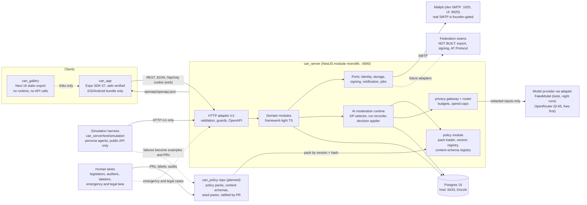
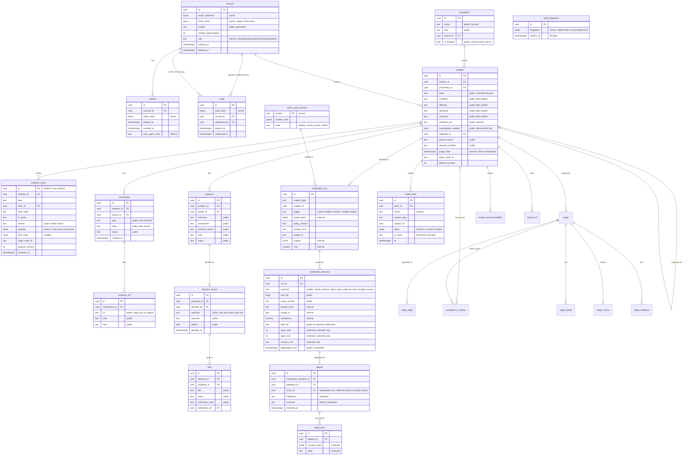

# CAN slice 1 system design

Status: design baseline for plan units. Binding inputs: `DECISIONS.md` (D-50 to D-53, D-72), `docs/spec/01-slice-1-brief.md`. `can_server` and `can_app` are scaffolds (D-25); this is the overview, with details in [flows/](flows/README.md) (execution flows), [components/](components/README.md) (modules per repo, built vs planned), [ai/](ai/README.md) (AI moderation design). Where this file and the brief disagree about lifecycle, the brief wins. Moderation follows D-51: the community legislates policy, AI agents apply it at every event, humans audit and label, and only the emergency and legal lane acts per case.

Lifecycle states, transitions and labels live only in [`docs/spec/01-slice-1-brief.md#4-lifecycle`](../spec/01-slice-1-brief.md#4-lifecycle); never restated here.

## 1. Containers

D-55 to D-58: persona simulation is the slice-1 proof (CI uses FakeModel); services are portable ([components/cross-cutting.md](components/cross-cutting.md)); every content type is schema-structured, with `DP-COMPLETENESS` and `DP-ASSUMPTIONS` checking submissions. D-59 to D-61: rule changes trigger [re-resolution](flows/re-resolution.md) (never silent, appealable), and legality checks apply the legal stack L0 to L6 ([legal-corpus-update](flows/legal-corpus-update.md)). D-72: lifecycle v2, see [flows/](flows/README.md) (prepare, volunteer review, DP-PUBLISH, stage DAG).

Ports: API :4000, Expo web :8081, gallery :3000, Postgres :5433.

Rules that follow from the diagram:
- The gallery never calls the API. It is static HTML and links to the repository, docs and open questions.
- The app talks only to `/v1`. Its client is generated from `can_server/openapi/openapi.json` (ADR 0002).
- Moderation is AI-executed under a ratified policy pack (D-51, D-53). Every model call goes through the privacy gateway behind a provider adapter; tests bind `FakeModel`, OpenRouter (D-65) needs `OPEN_ROUTER_KEY` and a spend cap (real member data is still founder-gated). Publication fails closed (`hold`). ADR 0006 is superseded. Policy lives in `can_policy` (D-52), see [components/can-policy.md](components/can-policy.md).
- No object storage, Redis or queue in slice 1. Jobs are Nest scheduled tasks over Postgres rows (`FOR UPDATE SKIP LOCKED`).

## 2. can_server module boundaries

Layout inside `can_server/src`: each module has `domain/` (pure TS, no Nest or Drizzle imports), `app/` (use cases taking ports), `infra/` (Drizzle repos, adapters), `http/` (controllers, DTO schemas). A lint rule forbids `domain/` importing `@nestjs/*`, `drizzle-orm` or `infra/`.

| Module | Owns | Depends on | Notes |
|---|---|---|---|
| `accounts` | account, session, invite, handle generation, email encryption, sign-in codes | audit, notification port | Only module that sees plaintext email, and only at send time. |
| `problems` | problem, problem_event, lifecycle transition engine, jurisdiction, draft_fingerprint, deterministic submission checks | accounts, moderation, audit | Executes the brief's table as data; invalid transitions fail atomically. |
| `moderation` | AI moderation runtime: DP selector, run recorder, decision applier; moderation_run, moderation_decision, appeal, label_task | problems, policy, ai-gateway, audit | Decisions carry rule ids, hints, policy version. Plan 09 (pending). |
| `policy` | pack loader, version registry, cache | platform | Loads `can_policy` packs by version and hash. Plan 09 (pending). |
| `ai-gateway` | privacy gateway, provider adapters, router, budgets | policy, platform | FakeModel and OpenRouter adapters (Anthropic optional). Plan 09 (pending). |
| `stages` | stage, stage_edge, acceptance_criterion, stage_option, stage_choice, stage_evidence, source_ref | problems, moderation | Stage DAG and gating engine (D-72, W10). |
| `review` | review_recommendation, volunteer opt-in | problems, moderation, accounts | Private volunteer review, quorum (D-72, W10). |
| `contributions` | contribution, evidence_ref (URL only) | problems, moderation | Typed contributions; the type list comes from the brief. |
| `proposals` | proposal | problems, contributions | Comparison data only; no voting rule. |
| `decisions` | decision_record | proposals, problems | States who decided, under which authority, why. |
| `tasks` | task | decisions, problems | Task status, verification evidence refs. |
| `audit` | audit_event | none | Write-only API for other modules; read for auditors and maintainers. |
| `platform` (not domain) | config, health, event log writer, clock, id generator (UUIDv7), retention jobs | none | Shared kernel; keep tiny. |

Dependency direction is one way; `audit` and `platform` depend on nothing; cross-module calls use exported use-case interfaces.

Per-module detail and build status: [components/server.md](components/server.md). Domain rules are unit-tested without Nest.

## 3. Slice 1 ERD

Conventions: ids are UUIDv7 (generated in the app by `platform.IdGenerator`). Every public-capable row carries `origin_node_id` (text, default the single node id) and `protocol_version` (int). Timestamps are `timestamptz`. Sensitivity: public / internal / restricted / secret. Retention is stated per entity in the table after the diagram.

Lifecycle v2 entities are detailed in [components/server.md](components/server.md); all are private until publish, and `review_recommendation` never becomes public. `draft_fingerprint` has no foreign key on purpose: it must not link back to an account or problem once the draft is purged. AI entities are expanded in [components/server.md](components/server.md). Sign-in codes live in `login_code` (account_id, code_hash secret, expires_at 10 min, attempts, consumed_at), an auxiliary table owned by `accounts`.

### Retention and deletion

| Entity | Retention |
|---|---|
| draft or rejected or withdrawn problem body | Hard-deleted 30 days after the state change (`purge_after`); UI shows the date. Event rows keep only type, states and timestamps, no body text. |
| draft_fingerprint | Deleted 90 days after creation, or at publish (T04) if the problem is published. Salt rotated yearly; old fingerprints expire, never re-hashed. |
| published problem, contribution, proposal, decision_record, task, problem_event | Kept; public record. Withdrawn contributions become tombstones (see UX). |
| moderation_run, moderation_decision, appeal, label_task | Kept with the problem (runs keep hashes and outputs, not raw prompts); `revision_hint` and spans cleared at purge for rejected drafts. |
| session | Deleted 30 days after expiry or revoke. |
| login_code | Deleted 24 hours after expiry or consumption. |
| invite | Kept 1 year after redeem; `code_hash` only. |
| audit_event | 2 years; no secrets inside. |
| account | Delete request: email fields erased immediately, handle kept as `deleted-member`, public contributions stay under that handle. |

### Sensitivity rules enforced in code

- `secret`: never leaves the server, never logged, never in OpenAPI responses (email, hashes, ciphertext).
- `restricted`: returned only to the owner or, for masked data, to auditors and labelers; role checked in the use case.
- `internal`: auditors, maintainers and admins only.
- `public`: only after the problem is published. Before publish, only the initiator sees drafts (auditors see sampled, masked runs); everyone else gets a tombstone, never 404 for withdrawn published items.
- Email: AES-256-GCM with a key from `EMAIL_ENC_KEY` env (never committed); lookup via HMAC-SHA256 blind index with `EMAIL_INDEX_KEY`.

## 4. Event log

`problem_event` is the append-only history for lifecycle and consequential changes; `audit_event` records operational and security actions (sign-in, role changes, auditor reads, emergency lane actions). Both are insert-only: the app DB role has no UPDATE or DELETE on them (migration grants), and a test asserts that.

- Id: UUIDv7. `origin_node_id` and `protocol_version` on every row. `prev_hash` nullable bytea, always null in slice 1 (reserved for the later chain; no hashing code now).
- Same-transaction write: the state change and its `problem_event` row commit together or not at all (a unit test injects a failing insert).
- No email, tokens or restricted text in payloads.

## 5. Auth flow

1. Redeem: `POST /v1/auth/signup {inviteCode, email}`. Server validates the unused invite, creates the account (email encrypted, blind index computed, handle generated), marks the invite redeemed, sends a 6-digit code. The response returns `{handle}` and never echoes the email.
2. Verify: `POST /v1/auth/verify {email, code}` (also the sign-in path for existing accounts, started by `POST /v1/auth/code {email}`). Codes: 6 digits, 10 minutes, 5 attempts then invalidated, hashed at rest, constant-time compare, rate limited per email and per IP. The response never reveals whether an email exists (always "If that address can sign in, we sent a code").
3. Session: on success the server issues an opaque 256-bit token, stores its SHA-256 hash, and sets a cookie `can_session` with `HttpOnly; Secure (not in dev); SameSite=Lax; Path=/v1`. Web CSRF: state-changing calls require header `X-CAN-CSRF` equal to a non-HttpOnly `can_csrf` cookie (double submit). Native: same endpoints return the token in the body only when header `X-CAN-Client: native` is present; stored in SecureStore. The native path is founder-gated for device verification.
4. Handle: generated from curated word lists (adjective + noun + 2 digits). One `POST /v1/me/handle/regenerate` allowed while the account has no published problem or contribution. Onboarding copy: "Your public name is {handle}. Your email is never shown."
5. Dev: SMTP to Mailpit (`localhost:1025`); the e2e tests read codes from the Mailpit HTTP API. A `MAIL_TRANSPORT=smtp` config is the only switch; real providers are founder-gated.
6. Session end: `POST /v1/auth/logout`; idle expiry 30 days sliding, absolute 90 days; a 401 `session_expired` shows WF-SESSION-1 and keeps the local draft.
7. Drafts autosave locally before sign-in and upload on the first authenticated save.

## 6. API surface (`/v1`)

Conventions: JSON; list responses are `{items: [...], nextCursor: string | null}`; query `?cursor=&limit=` (limit default 20, max 50); the server trims all string input; errors are `{error: {code, message, fieldErrors?}}` with stable codes; mutations accept `Idempotency-Key`; times are ISO 8601 UTC. Actors: anon, member, initiator (owner of the problem), auditor, labeler, maintainer, admin.

| Method | Path | Actor | Purpose |
|---|---|---|---|
| GET | /v1/health | anon | Liveness and DB check. |
| POST | /v1/auth/signup | anon | Redeem invite, create account, send code. |
| POST | /v1/auth/code | anon | Request a sign-in code. |
| POST | /v1/auth/verify | anon | Exchange code for session. |
| POST | /v1/auth/logout | member | End session. |
| GET | /v1/me | member | Handle, role, counts. No email. |
| POST | /v1/me/handle/regenerate | member | One regenerate before first publish. |
| GET | /v1/jurisdictions | anon | Picker list (fictional). |
| GET | /v1/problems | anon | Published problems; filters `state`, `jurisdictionId`, `q`. |
| GET | /v1/problems/{id} | anon | Problem detail or tombstone. Draft body only for the initiator. |
| GET | /v1/problems/{id}/events | anon | Public timeline, cursor paged. |
| POST | /v1/problems | member | Create draft. |
| PATCH | /v1/problems/{id} | initiator | Edit draft or needs-revision fields. |
| POST | /v1/problems/{id}/checks | initiator | Run deterministic checks, return privacy flags with spans. |
| GET | /v1/problems/{id}/preview | initiator | Exact public rendering plus publishing explanation. |
| POST | /v1/problems/{id}/transitions | per brief | Request any lifecycle transition `{to, reason, fields}`; actor rules come from the brief's table. Fails atomically with `invalid_transition` or `not_permitted`. |
| GET | /v1/problems/{id}/contributions | anon | Typed contributions, grouped client-side by type. |
| POST | /v1/problems/{id}/contributions | member | Add contribution with `evidenceRefs[{url,note}]`. |
| PATCH | /v1/contributions/{id} | author | Edit or withdraw (tombstone). |
| GET | /v1/problems/{id}/proposals | anon | List proposals. |
| POST | /v1/problems/{id}/proposals | member | Create proposal. |
| PATCH | /v1/proposals/{id} | author | Edit proposal. |
| POST | /v1/problems/{id}/decision | initiator | Record decision for a proposal (authority text required). |
| GET | /v1/problems/{id}/tasks | anon | List tasks. |
| POST | /v1/problems/{id}/tasks | initiator | Create task from decision. |
| PATCH | /v1/tasks/{id} | assignee or initiator | Update status and verification note. |
| GET | /v1/me/problems | member | My drafts and submissions, with purge dates. |
| GET | /v1/problems/{id}/moderation | initiator | Runs summary and decisions for this problem (hints beside fields, policy version). |
| POST | /v1/moderation/decisions/{id}/appeals | initiator | File appeal before `appealableUntil`; starts the independent re-run. |
| GET | /v1/me/notices | member | "Re-reviewed under policy vX" notices. |
| GET | /v1/audit/samples | auditor | Sampled decisions for audit. |
| POST | /v1/label-tasks/{id}/labels | labeler | Submit a masked label. |
| GET | /v1/rules | anon | Published rule ids and plain texts (for hints and the appeal screen). |
| GET | /v1/content-schemas/{type} | member | Content schema by type and `?version=` (plan 10, pending). |
| POST | /v1/invites | maintainer or admin | Issue an invite code (shown once). |

Under D-51 no moderator-queue or per-item decision endpoints exist. Lifecycle v2 endpoints (stage plan, options, review): [components/server.md](components/server.md). Omissions: no email on responses, no DELETE on public records, no uploads, no search beyond `q`, no endpoint to overrule a single decision.

## 7. Contract flow

Server code (Nest DTO schemas via zod, one source for validation and OpenAPI) generates `can_server/openapi/openapi.json` with `npm run openapi`. `can_app` runs `npm run gen:api`, which reads `../can_server/openapi/openapi.json` and writes `src/api/schema.d.ts`. Flow: [flows/contract-flow.md](flows/contract-flow.md). CI in each repo: server fails if `openapi.json` is stale versus code; app fails if generated output differs from committed. Breaking changes need a `/v2` or an additive field. Protocol meaning (event types, rule ids) lives in `docs/spec`.

## 8. Decentralization seams (interfaces only)

Defined as TypeScript interfaces in `platform/ports`, with one in-process implementation each. No federation code exists in slice 1 (D-22).

| Port | Slice 1 adapter | Later adapters |
|---|---|---|
| `IdentityPort` (resolve actor, issue session) | Email-code accounts | Portable or federated identity |
| `StoragePort` (put, get public blobs) | Not used (no uploads); interface only | S3, content-addressed stores |
| `SigningPort` (sign event bytes, verify) | `NoSigner` returns null | Node key, user key |
| `NotificationPort` (send email) | SMTP via Mailpit | Real provider, push |
| `JobPort` (schedule, run) | Nest schedule plus Postgres rows | Queue |
| `AiGatewayPort` (privacy gateway, model call) | `FakeModel` in tests; OpenRouter adapter (D-65) | Other providers, self-hosted models |

Structural escapes already in the schema: UUIDv7, `origin_node_id`, `protocol_version`, append-only events, nullable `prev_hash`, no hostname stored in ids or rows.

## 9. Test strategy

| Layer | Tooling | Scope |
|---|---|---|
| Domain unit | Vitest, no Nest | Transition table driven tests (generated from the brief's table data), privacy and eligibility rules, appeal re-run selection, retention math, handle generator. Property tests (fast-check) for "invalid transitions never change state". |
| Server e2e | Vitest + supertest against `docker compose` Postgres and Mailpit | Auth flow reading codes from Mailpit, full lifecycle, cookie and CSRF behaviour, append-only grants, same-transaction rollback, pagination, authorization matrix per endpoint. |
| Contract | Script | `openapi.json` is current; generated client compiles. |
| App unit | Jest with mocked generated client | Screens for all UI-unit template states (loading, empty, error, offline, session-expired, not-permitted, tombstone, validation). |
| App e2e | Playwright on Expo web, mocked or real API | Three journeys from `ux/journeys.md`, 200 percent zoom check, keyboard-only path, axe-core scan per screen. |
| Fixture corpora | Plain JSON files, versioned, in `can_server/test/fixtures/` | `privacy-flags.json`, `eligibility.json`, `reposts.json`; persona scenarios under `test/simulation`. All fictional. Rules cite `RULE-ID` from `docs/spec/constitution/rules.md`; every corpus row names the rule it tests. |
| Lint gates | oxlint, eslint-plugin-react-native-a11y, grep | Logical start/end only, no string concatenation in UI copy, no em or en dashes in copy, no hex colours outside tokens. |

Moderation tests use `FakeModel` with recorded responses and no paid calls. Eval sets and replay fixtures live with the policy pack ([ai/evaluation.md](ai/evaluation.md)); they start small and hand-written, and measured precision and recall come later.

## 10. Web-first verification

No simulators or devices exist (D-8). Done means: verify script green; server e2e green against compose; Playwright green on Expo web at 360 px and 1280 px; `expo export -p ios` and `-p android` bundle successfully. Native session storage, push, deep links and device screen readers are founder-gated, not claimed as verified.

## 11. Operations notes

Structured JSON logs with request id; email, codes, tokens and body text are never logged (tested redaction list). `/v1/health` reports DB reachability and migration version. Secrets only from env (`.env.example` lists names). Portability contract (D-57): [components/cross-cutting.md](components/cross-cutting.md). Real mail, TLS and hosting are outside slice 1.
