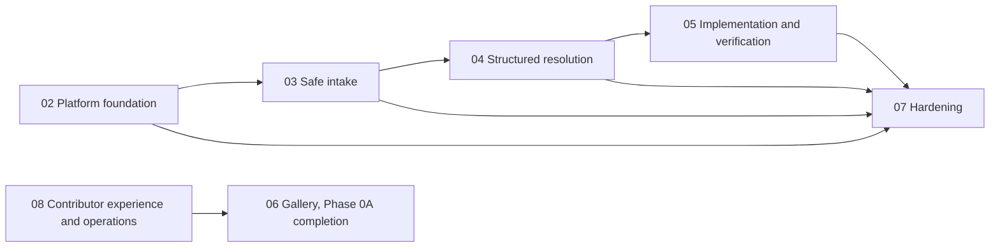

# Plan corpus root

## Mission

Community Action Network is a public, open-source platform where people surface a real public problem, bring evidence, work out what is causing it, propose lawful solutions, track who does what, and check whether it worked. Problem, evidence, lawful solution, tracked outcome. It is not an advice service, an emergency service, a feed or a petition site. Nothing handles real problems yet: the specification, constitution and repositories exist, and everything else is planned (see `manifesto.md`).

## How a human contributor picks work

- A good-first index at `docs/contributing/` will be generated by unit 08-u02. Until it exists, run `node plans/tools/corpus.mjs next --hours 2` and pick a unit from the `can_app` or `can_gallery` lane that has no `needs` (no docker, db or mail).
- Check that the unit is in an approved plan, has `founder_gate: false`, and that every `depends_on` unit is `done`. Run `node plans/tools/corpus.mjs lint` first to confirm the corpus is healthy.
- Read the unit file and the specs it cites, stay inside its `writes` globs, and run its `verify` commands from its repo.
- Open a PR that references the unit id (for example `06-u02`) in the title. The orchestrator updates unit status after merge.

## How the corpus works

- Format: [FORMAT.md](FORMAT.md) defines plans, units, frontmatter and the selection rules.
- Tools: `node plans/tools/corpus.mjs lint | next --hours N | graph | set` ([source](tools/corpus.mjs), tests: `node plans/tools/test/run.mjs`). Selecting a night's work is a script, not model reasoning.
- Units are one-repo, at most 1.5 agent-hours, and are briefed with the unit file plus the area skill in `.claude/skills/` (can-spec, can-root, can-server, can-app, can-code-large).
- Only the orchestrator writes unit status. Agents return commit SHAs.
- `DECISIONS.md` is binding and is reviewed each morning. Open questions go to `docs/open-questions/`, never into per-plan files.
- Night reports live in `plans/runs/YYYY-MM-DD.md`.
- Founder-gated units (`founder_gate: true`) are never selected automatically.

## Plan index

Generated from the corpus (snapshot; recompute with the tool). Lanes are repos; `root` is the superproject.

| id | title | approved | units | est hours | lanes | depends_on_plans | founder-gated |
|---|---|---|---|---|---|---|---|
| 02 | Platform foundation | true | 25 | 31.3 | root, can_app, can_server | none | 02-u22, 02-u23 |
| 03 | Safe intake | true | 25 | 33.2 | can_app, can_server | 02 | none |
| 04 | Structured resolution | true | 11 | 15.2 | can_app, can_server | 03 | none |
| 05 | Implementation and verification | true | 9 | 12.4 | can_app, can_server | 04 | 05-u09 |
| 06 | Gallery, Phase 0A completion | true | 16 | 20.0 | can_gallery | 08 | 06-u11, 06-u12, 06-u14 |
| 07 | Hardening | true | 11 | 14.7 | root, can_app, can_server | 02, 03, 04, 05 | 07-u11 |
| 08 | Contributor experience and operations | true | 14 | 14.5 | root, can_app, can_gallery, can_server | none | 08-u14 |
| | **Total** | | 111 | 141.3 | | | 8 |

## Plan dependencies

Informational: plan-level edges show intended ordering but are not enforced. Only unit-level `depends_on` gates selection, and `lint` warns if a plan edge has no unit edge behind it. Plan level only here; for unit level run `node plans/tools/corpus.mjs graph`.



## For maintainers: overnight runs

1. From the superproject in Claude Code, run the trigger `/can-code-large night` (start the machine with `caffeinate -dimsu`). It is idempotent: if `plans/runs/<date>.md` exists, the run resumes from it.
2. Preflight: Docker check (units needing `db` or `docker` are skipped if it is down), a clean-repo check per repo (a dirty repo aborts its lane, nothing is stashed), and a null `npm run verify` per repo.
3. Select: `node plans/tools/corpus.mjs next --hours 6`. Only approved plans, satisfied dependencies and ungated units are eligible, and each lane stops at 80% of the hours.
4. Run: a fresh agent per unit on branch `night/<date>` in each repo, stacked on the newest unmerged night branch. Up to 3 fix attempts. A unit still red is committed to `wip/<date>-<unit>` and marked `blocked`. Two blocked units in a row halt the lane. No new unit starts in the last 75 minutes.
5. Close-out: live end-to-end run, pointer bumps, skill fold-back on the night branch, and the morning report.

Morning:
- Read `plans/runs/<date>.md` and `DECISIONS.md`, and answer anything added to `docs/open-questions/`.
- Merge the `night/*` branches in order: submodules first (`can_server`, `can_app`, `can_gallery`), then the superproject. Fast-forward or `--no-ff`, never squash.

## Night 1 dry run (snapshot)

Output of `node plans/tools/corpus.mjs next --hours 6` when all 111 units were `todo`. It will drift as units complete; rerun the command for the current queue.

```
night plan: 6h, budget 4.8h per lane

lane . (4.0h)
  02-u01  1h  sonnet  Extend verify-all.sh with flags and missing gates
  08-u01  1.5h  sonnet  corpus.mjs catalog command and optional tags field
  08-u02  1h  sonnet  Good-first-units index generated from plans
  08-u11  0.5h  sonnet  Night-run report template

lane can_app (4.0h)
  02-u24  1.5h  sonnet  Adopt gluestack-ui: install, pin and generate the theme from tokens
  02-u25  1.5h  sonnet  Adopt gluestack-ui: re-implement civic wrappers on gluestack primitives
  02-u13  1h  sonnet  API client infrastructure: CSRF, error envelope, session events

lane can_gallery (4.5h)
  06-u01  1.5h  sonnet  Factual-claims register and Phase 0A content audit
  06-u15  1.5h  sonnet  Adopt gluestack-ui for gallery surfaces: install, pin and tokens theme
  06-u16  1.5h  sonnet  Adopt gluestack-ui for gallery surfaces: migrate layout and components, drop component CSS

lane can_server (4.5h)
  02-u09  0.8h  sonnet  Lifecycle state vocabulary from the brief
  02-u02  1h  sonnet  Config hardening and structured logging  [needs docker,db]
  02-u03  1.2h  sonnet  Shared kernel: error envelope, clock, pagination, noindex  [needs docker,db]
  02-u04  1.5h  sonnet  Accounts, audit and jurisdiction schema with insert-only grants  [needs docker,db]

skipped:
  02-u05: over time budget
  02-u06: over time budget
  02-u07: deps not satisfied: 02-u05, 02-u06
  02-u08: deps not satisfied: 02-u07
  02-u10: deps not satisfied: 02-u08
  02-u11: deps not satisfied: 02-u10
  02-u12: deps not satisfied: 02-u11
  02-u14: over time budget
  02-u15: deps not satisfied: 02-u14
  02-u16: deps not satisfied: 02-u08, 02-u15
  02-u17: deps not satisfied: 02-u16, 02-u14
  02-u18: deps not satisfied: 02-u17
  02-u19: deps not satisfied: 02-u10, 02-u15
  02-u20: deps not satisfied: 02-u19, 02-u11
  02-u21: deps not satisfied: 02-u20, 02-u18, 02-u12
  02-u22: founder_gate
  02-u23: founder_gate
  03-u01: over time budget
  03-u02: over time budget
  03-u03: over time budget
  03-u04: deps not satisfied: 02-u10
  03-u05: deps not satisfied: 03-u01, 02-u10, 02-u08
  03-u06: deps not satisfied: 03-u05, 03-u03
  03-u07: deps not satisfied: 03-u06
  03-u08: deps not satisfied: 03-u02, 03-u03, 03-u04, 03-u07
  03-u09: deps not satisfied: 03-u07
  03-u10: deps not satisfied: 03-u09, 03-u08
  03-u11: deps not satisfied: 03-u10, 02-u06
  03-u12: deps not satisfied: 03-u10
  03-u13: deps not satisfied: 03-u12, 03-u11
  03-u14: deps not satisfied: 03-u13, 03-u04
  03-u15: deps not satisfied: 02-u08
  03-u16: over time budget
  03-u17: deps not satisfied: 03-u16, 03-u06, 02-u14, 02-u16
  03-u18: deps not satisfied: 03-u17
  03-u19: deps not satisfied: 03-u18, 03-u08, 03-u07
  03-u20: deps not satisfied: 03-u19
  03-u21: deps not satisfied: 03-u20, 03-u10, 03-u09
  03-u22: deps not satisfied: 03-u21, 03-u12
  03-u23: deps not satisfied: 03-u09, 03-u15, 02-u16, 02-u15
  03-u24: deps not satisfied: 03-u23, 03-u10, 03-u08
  03-u25: deps not satisfied: 03-u24, 03-u13
  04-u01: deps not satisfied: 03-u14
  04-u02: deps not satisfied: 04-u01, 03-u08
  04-u03: deps not satisfied: 04-u02, 03-u13, 03-u11
  04-u04: deps not satisfied: 04-u03
  04-u05: deps not satisfied: 04-u04
  04-u06: deps not satisfied: 04-u05
  04-u07: deps not satisfied: 04-u06, 03-u11
  04-u08: deps not satisfied: 04-u02, 02-u20, 02-u14
  04-u09: deps not satisfied: 04-u04, 04-u08
  04-u10: deps not satisfied: 04-u09, 04-u05
  04-u11: deps not satisfied: 04-u07, 04-u10
  05-u01: deps not satisfied: 04-u07
  05-u02: deps not satisfied: 05-u01
  05-u03: deps not satisfied: 05-u02
  05-u04: deps not satisfied: 05-u03
  05-u05: deps not satisfied: 05-u01, 05-u02, 04-u10
  05-u06: deps not satisfied: 05-u03, 05-u04, 04-u10
  05-u07: deps not satisfied: 05-u02, 05-u04, 02-u15
  05-u08: deps not satisfied: 05-u06, 05-u05, 05-u04, 03-u24
  05-u09: founder_gate
  06-u02: over time budget
  06-u03: deps not satisfied: 06-u02, 08-u01
  06-u04: deps not satisfied: 06-u03
  06-u05: deps not satisfied: 06-u04
  06-u06: deps not satisfied: 06-u02
  06-u07: deps not satisfied: 06-u02
  06-u08: deps not satisfied: 06-u03, 06-u05, 06-u06, 06-u07
  06-u09: deps not satisfied: 06-u08
  06-u10: deps not satisfied: 06-u08, 06-u09
  06-u11: founder_gate
  06-u13: deps not satisfied: 06-u09
  06-u14: founder_gate
  07-u01: deps not satisfied: 03-u03, 03-u02
  07-u02: deps not satisfied: 04-u07
  07-u03: deps not satisfied: 07-u02, 05-u04
  07-u04: deps not satisfied: 07-u03
  07-u05: deps not satisfied: 07-u04
  07-u06: deps not satisfied: 02-u21, 05-u08, 05-u07, 04-u11, 03-u25
  07-u07: deps not satisfied: 07-u06
  07-u08: deps not satisfied: 07-u06, 07-u07
  07-u09: deps not satisfied: 07-u07
  07-u10: deps not satisfied: 05-u08
  07-u11: founder_gate
  08-u03: over time budget
  08-u04: deps not satisfied: 08-u03
  08-u05: deps not satisfied: 08-u04
  08-u06: deps not satisfied: 08-u04
  08-u07: deps not satisfied: 08-u04
  08-u08: over time budget
  08-u09: deps not satisfied: 08-u08
  08-u10: deps not satisfied: 08-u03, 08-u08
  08-u12: over time budget
  08-u13: over time budget
  08-u14: founder_gate
```
