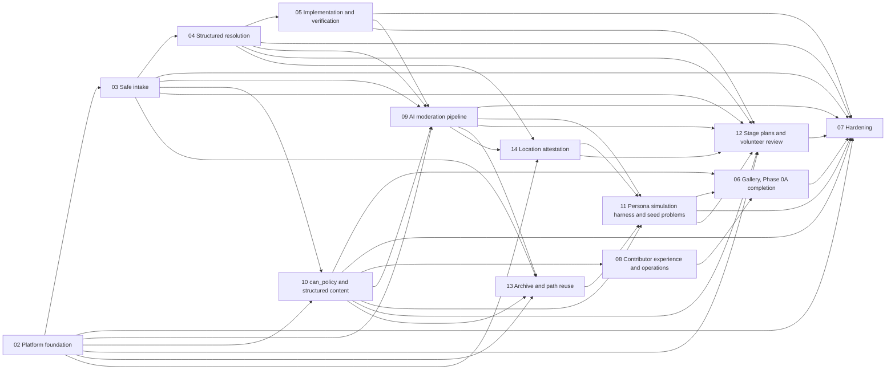

# Plan corpus root

## Mission

Community Action Network is a public, open-source platform where people surface a real public problem, bring evidence, work out what is causing it, propose lawful solutions, track who does what, and check whether it worked. The poster first prepares the problem with facts, sources and finish lines, and opted-in volunteers review it privately with personal data masked. AI agents then publish under rules the community writes, and apply them on every update and again after publication. A published problem gets a stage plan, serial or parallel, where each stage has options, a choice, work, evidence and an AI-checked finish line. Contributions are labelled impacted or guest using private location proofs, with no one learning where a person is. Content is structured everywhere: schema forms, not free text. Decisions are checked against a legal stack from human rights instruments down to the city, and a change in law or rule re-resolves affected problems. Every problem that ends, solved or not, goes to a public archive that seeds AI-suggested paths for similar problems elsewhere, which the poster accepts or declines. All of it is proven first by persona simulation on real-framing seed problems with synthetic evidence. It is not an advice service, an emergency service, a feed or a petition site. Nothing handles real problems yet: the specification, constitution and repositories exist, and everything else is planned (see `manifesto.md`).

## How a human contributor picks work

- A good-first index at `docs/contributing/` will be generated by unit 08-u02. Until it exists, run `node plans/tools/corpus.mjs next --hours 2` and pick a unit from the `can_app` or `can_gallery` lane that has no `needs` (no docker, db or mail).
- Check that the unit is in an approved plan, has `founder_gate: false`, and that every `depends_on` unit is `done`. Run `node plans/tools/corpus.mjs lint` first to confirm the corpus is healthy.
- Read the unit file and the specs it cites, stay inside its `writes` globs, and run its `verify` commands from its repo.
- Open a PR that references the unit id (for example `06-u02`) in the title. The orchestrator updates unit status after merge.

## How the corpus works

- Format: [FORMAT.md](FORMAT.md) defines plans, units, frontmatter and the selection rules.
- Tools: `node plans/tools/corpus.mjs lint | next --hours N | graph | set` ([source](tools/corpus.mjs), tests: `node plans/tools/test/run.mjs`). Selecting a night's work is a script, not model reasoning.
- Units are one-repo, at most 1.5 agent-hours, and are briefed with the unit file plus the area skill in `.claude/skills/` (can-spec, can-root, can-server, can-app, can-code-large).
- Only the orchestrator writes unit status. Agents return commit SHAs.
- `skipped` units are superseded and never run; `next` ignores them.
- `DECISIONS.md` is binding and is reviewed each morning. Open questions go to `docs/open-questions/`, never into per-plan files.
- Night reports live in `plans/runs/YYYY-MM-DD.md`.
- Founder-gated units (`founder_gate: true`) are never selected automatically.

## Plan index

Generated from the corpus (snapshot; recompute with the tool). Lanes are repos; `root` is the superproject. Estimated hours count todo units only.

| id | title | approved | units | todo | skipped | done | est hours (todo) | lanes | depends_on_plans | founder-gated |
|---|---|---|---|---|---|---|---|---|---|---|
| 02 | Platform foundation | true | 25 | 25 | 0 | 0 | 31.3 | root, can_app, can_server | none | 02-u22, 02-u23 |
| 03 | Safe intake | true | 25 | 14 | 11 | 0 | 18.5 | can_app, can_server | 02 | none |
| 04 | Structured resolution | true | 11 | 11 | 0 | 0 | 15.2 | can_app, can_server | 03 | none |
| 05 | Implementation and verification | true | 9 | 9 | 0 | 0 | 12.4 | can_app, can_server | 04 | 05-u09 |
| 06 | Gallery, Phase 0A completion | true | 25 | 24 | 0 | 1 | 31.5 | can_gallery | 08, 10, 11 | 06-u11, 06-u12, 06-u14 |
| 07 | Hardening | true | 22 | 21 | 1 | 0 | 25.2 | root, can_app, can_gallery, can_server | 02, 03, 04, 05, 06, 09, 10, 11, 12 | 07-u11 |
| 08 | Contributor experience and operations | true | 15 | 14 | 0 | 1 | 14.9 | root, can_app, can_gallery, can_policy, can_server | 10 | 08-u14 |
| 09 | AI moderation pipeline | true | 74 | 74 | 0 | 0 | 104.0 | can_app, can_server | 02, 03, 04, 05, 10 | 09-u46 |
| 10 | can_policy and structured content | true | 69 | 68 | 0 | 1 | 90.8 | root, can_app, can_policy, can_server | 02, 03 | 8 units |
| 11 | Persona simulation harness and seed problems | true | 50 | 50 | 0 | 0 | 67.9 | can_app, can_policy, can_server | 09, 10, 13, 14 | 11-u40, 11-u41, 11-u42 |
| 12 | Stage plans and volunteer review | true | 26 | 26 | 0 | 0 | 36.9 | can_app, can_server | 02, 03, 04, 05, 09, 10, 11, 14 | none |
| 13 | Archive and path reuse | true | 28 | 28 | 0 | 0 | 39.9 | can_app, can_policy, can_server | 02, 03, 09, 10 | none |
| 14 | Location attestation | true | 29 | 29 | 0 | 0 | 36.6 | root, can_app, can_server | 02, 04, 09 | 14-u28, 14-u29, 14-u30, 14-u32 |
| | **Total** | | 408 | 393 | 12 | 3 | 525.1 | | | 24 |

## Plan dependencies

Informational: plan-level edges show intended ordering but are not enforced. Only unit-level `depends_on` gates selection, and `lint` warns if a plan edge has no unit edge behind it. Plan level only here; for unit level run `node plans/tools/corpus.mjs graph`.



## What the plans build

- **02 Platform foundation.** Hardened config, the shared kernel, invite-only accounts with email codes, sessions, generated handles, a dev seed, the app shell and auth screens, a thin problems read slice, the Playwright smoke harness and the root verify script.
- **03 Safe intake.** Private drafts, deterministic privacy and eligibility checks, the lifecycle state machine, emails, retention jobs and the steward invite screen. Human moderation units were superseded (skipped) by plans 09 and 10.
- **04 Structured resolution.** Typed contributions as schema forms, side-by-side proposals, recorded decisions with a legal-gate record, duplicate links and opt-in follows with notifications.
- **05 Implementation and verification.** Tasks and blockers, verification evidence, every terminal or resting transition, public Resolution records with policy versions, and the external routes screen.
- **06 Gallery, Phase 0A completion.** The read-only public gallery in `can_gallery`: sourced claims, task catalog and founding role pages from real units, accessibility and performance gates, with founder-gated deploy pieces prepared but not run.
- **07 Hardening.** Adversarial inputs, rate limits, the authorization matrix, security checklist, backup and restore, the seeded end-to-end run, and portability work (images, env contract, readiness, prod-like rehearsal) without deploying anything.
- **08 Contributor experience and operations.** Issue and PR templates, CI for every repo, one-command bootstrap, the good-first index and catalog, a night-run report template and release policies.
- **09 AI moderation pipeline.** AI runs applying the policy pack before publication, on every update and after, appeals by independent re-run and community labelling, auditor sampling, re-resolution, and a logged emergency and legal lane. FakeModel first; live providers are founder-gated.
- **10 can_policy and structured content.** The `can_policy` repo with the first policy pack, content schemas, prompts and eval sets per decision point, schema-rendered forms with optional AI fill-assist, policy proposal UI, and the legal layer corpora with provenance.
- **11 Persona simulation harness and seed problems.** AI personas driving the real pipeline over its public API, real-framing seed problems with synthetic evidence, a graduation report and the maintainers screen. Live runs and opening public participation are founder-gated.
- **12 Stage plans and volunteer review.** Lifecycle v2: private preparation, opted-in volunteer review with masked personal data, AI publication, a per-problem stage plan (a DAG) with its gating engine and screens, plan changes, contributing ahead to planned stages, the impacted and guest label UI and the end-to-end journey.
- **13 Archive and path reuse.** A public archive of every ended problem with personal data stripped, AI retrieval of similar archived problems during preparation, adapted path proposals the poster accepts or declines with the source always credited, and AI-drafted stage plans from accepted suggestions.
- **14 Location attestation.** Impacted versus guest labels from a private on-device check: versioned affected areas, single-use server challenges, App Attest and Play Integrity where native, rate limits, only four stored fields, and a spike toward a blinded cell-membership proof.

## For maintainers: overnight runs

1. From the superproject in Claude Code, run the trigger `/can-code-large night` (start the machine with `caffeinate -dimsu`). It is idempotent: if `plans/runs/<date>.md` exists, the run resumes from it.
2. Preflight: Docker check (units needing `db` or `docker` are skipped if it is down), a clean-repo check per repo (a dirty repo aborts its lane, nothing is stashed), and a null `npm run verify` per repo.
3. Select: `node plans/tools/corpus.mjs next --hours 6`. There are five lanes: root, `can_server`, `can_app`, `can_gallery` and `can_policy`. Only approved plans, satisfied dependencies and ungated `todo` units are eligible (`skipped` units never run), and each lane stops at 80% of the hours.
4. Run: a fresh agent per unit on branch `night/<date>` in each repo, stacked on the newest unmerged night branch. Up to 3 fix attempts. A unit still red is committed to `wip/<date>-<unit>` and marked `blocked`. Two blocked units in a row halt the lane. No new unit starts in the last 75 minutes.
5. Close-out: live end-to-end run, pointer bumps, skill fold-back on the night branch, and the morning report.

Morning:
- Read `plans/runs/<date>.md` and `DECISIONS.md`, and answer anything added to `docs/open-questions/`.
- Merge the `night/*` branches in order: submodules first (`can_server`, `can_app`, `can_gallery`, `can_policy`), then the superproject. Fast-forward or `--no-ff`, never squash.

## Night 1 snapshot

Output of `node plans/tools/corpus.mjs next --hours 6` with 393 units `todo`, 12 `skipped` and 3 `done`. It will drift as units complete; rerun the command for the current queue. The long skipped list is condensed below.

```
night plan: 6h, budget 4.8h per lane

lane . (4.7h)
  10-u02  1.2h  sonnet  Scaffold can_policy and add it as the fifth submodule
  02-u01  1h  sonnet  Extend verify-all.sh with flags and missing gates
  08-u01  1.5h  sonnet  corpus.mjs catalog command and optional tags field
  08-u02  1h  sonnet  Good-first-units index generated from plans

lane can_app (4.0h)
  02-u24  1.5h  sonnet  Adopt gluestack-ui: install, pin and generate the theme from tokens
  02-u25  1.5h  sonnet  Adopt gluestack-ui: re-implement civic wrappers on gluestack primitives
  02-u13  1h  sonnet  API client infrastructure: CSRF, error envelope, session events

lane can_gallery (4.5h)
  06-u01  1.5h  sonnet  Factual-claims register and Phase 0A content audit
  06-u15  1.5h  sonnet  Adopt gluestack-ui for gallery surfaces: install, pin and tokens theme
  06-u16  1.5h  sonnet  Adopt gluestack-ui for gallery surfaces: migrate layout and components, drop component CSS

lane can_policy (0.0h)

lane can_server (4.5h)
  10-u04  1.5h  sonnet  Policy module: pack loader, version registry, content-schema registry, PII-safe cache, fixture pack  [needs docker,db]
  02-u09  0.8h  sonnet  Lifecycle v2 problem-state vocabulary from the lifecycle spec (states, labels, policy-version helpers)
  02-u02  1h  sonnet  Config hardening and structured logging  [needs docker,db]
  02-u03  1.2h  sonnet  Shared kernel: error envelope, clock, pagination, noindex  [needs docker,db]

skipped (condensed):
  338 units: deps not satisfied
  21 units: founder_gate
  20 units: over time budget
```
